# 關於 Java Tutorial

Java Tutorial 系列為六小時課程，目的是想讓對 Java 有興趣但想在短時間內上手的開發者，可以藉由六小時的課程，快速概覽 Java 的生態系。

六小時絕對不可能讓開發者完全學會某個技術，然後用該技術飛天鑽地，六小時目的在於介紹一個技術的輪廊，某些程度上要呈現該技術的優良部份（The good part），並期望在六小時課程結束之後，開發者可以有個出發點與方向，自行去參與更多的主題，研究更多的內容。

Java 就現在來看，可算是門不新甚至有點古老的語言，就完成 Java Tutorial 的這個時間點而言，Java 版本已至 JDK8，就參考實作（Reference Implementation, RI）而言，也有各種 Sun JDK、OpenJDK 等實作，如果你是第一次來到 Java 的世界，面對這些版本與實作會有些混亂，因而課程一開始就先來快速認識這些東西吧！

# Java Tutorial 第一堂

以完成 Java Tutorial 的時間點來說，正式釋出的 JDK 最新版本為 JDK8，Java 向後相容（Backward compatibility）做得很好，過去 JDK 版本編譯後可運行的 Java 程式，盡力保證在新版本的 JDK 上可以運行；不過，Java 歷經幾個重要的版本變化，有些版本影響了人們稱呼它的方式，有些版本則在語法上有重大變化，因而有必要先瞭解一下過去 Java 的幾個重大版本。

## JDK 的版本與規範

以完成 Java Tutorial 的時間點來說，正式釋出的 JDK 最新版本為 JDK8，Java 向後相容（Backward compatibility）做得很好，過去 JDK 版本編譯後可運行的 Java 程式，盡力保證在新版本的 JDK 上可以運行；不過，Java 歷經幾個重要的版本變化，有些版本影響了人們稱呼它的方式，有些版本則在語法上有重大變化，因而有必要先瞭解一下過去 Java 的幾個重大版本。

- JDK 的版本

**1995 年 5 月 23  日被認為是 Java 的生日**，Sun 發表了 Java Development Kits（當時的JDK全名）1.0a2；1998 年 12 月 4 日，Sun 發佈 Java 2 Platform，簡稱 J2SE 1.2，從該版本之後，大家開始習慣用 Java 2 這個名稱，之後約每隔兩年發表的 J2SE 1.3、J2SE 1.4，也一直使用 Java 2 這個名稱。

**從 J2SE 1.2 至 1.4 的這幾個 Java 2 版本**，JDK 工具、JVM 效能與 API 的功能不斷增強，語法基本上變化不大；**2004 年 9 月 29 日發表了 J2SE 5.0，版號從 1.4 突增至 5.0**，主要是為了彰顯這個版本增加的重大語法以及功能躍進，至今常用的重大語法變化有像是泛型（Generics）、列舉（Enum）、標註（Annotation）等，都是在這個版本奠定。

**2006 年 12 月 11 日，Sun 發表 Java Platform, Standard Edition 6，簡稱 Java SE 6，Sun 官方從這個版本開始，不再使用 Java 2 而是使用 Java 這個名詞了**，過去基於 Java 2 的 J2EE（Java 2 Platform, Enterprise Edition）與 J2ME（Java 2 Platform, Micro Edition），後續在基於 Java SE 6 版本而推出的新版本，也正名為 Java EE 與 Java ME，雖然如此，Java 2、J2SE、J2EE、J2ME 這些名稱，因為大家耳熟能詳，其實一直仍常在開發者之間聽到。

從 Java SE 6 之後，停滯了四年多未曾有過新版本的發表，**現在的 Java 是 Oracle 所擁有**，原因在於從兩千年網路泡沫化以來，以經營伺服器為主的 Sun 營運一直低迷不振，最後在 2010 年 4 月被 Oracle 併購，在易主之後，Oracle 於 2011 年 7 月 28 日推出了 Java SE 7，這個版本就語法上而言只有一些小變化（主要是語法蜜糖），不過其實捨棄了原本 JDK7 規劃中應用的一些重大功能，目的是為了穩定 Java 開發者的信心而推出的版本，有些重大功能，像是 Lambda，被推延至 Java SE 8，有些功能甚至要在 Java SE 9 之後的版本才被重新考慮。

JDK8 於 2014 年 3 月 18 日釋出，其中最受人曙目的功能為 Lambda，關於 Lambda 的介紹，可參考〈[認識 Lambda / Closure](http://www.codedata.com.tw/forum/viewthread.php?tid=86&extra=page%3D1)〉，以及〈[Java 開發者的函數式程式設計](http://www.codedata.com.tw/forum/viewthread.php?tid=127&extra=page%3D1)〉。

- JCP 與 JSR

在定義 Java 未來功能與特性的過程中，為了讓對 Java 有興趣的廠商、組織、開發者等各方使用者可以參與，Sun 於 1998 年組成了 [JCP（Java Community Process）](http://www.jcp.org/en/home/index) 開放性國際組織，讓 Java 演進過程成為代表成員公開監督的過程。

想在未來版本 Java 中加入的功能或特性，必須提交至 JCP 整理規範於 **JSR（Java Specification Requests）**，JSR 而後經過 **JCP 執行委員會（Executive Committee）**投票決定而成為最終標準文件，最終的 JSR 會提供一個免費且公開原始碼的**參考實作（Reference Implementation, RI）**。

## Oracle JDK 與 OpenJDK

在過去，Sun JDK 實現，也就是被 Oracle 收購之後的 Oracle JDK 實現，就是 JDK 的參考實作，有興趣的廠商或組織也可以根據 JSR 自行實現產品，像是 IBM 就根據 JSR 實作了自家的 [IBM JDK](http://www.ibm.com/developerworks/java/jdk/)，並且只有通過 [TCK](http://en.wikipedia.org/wiki/Technology_Compatibility_Kit) 相容性測試的實作，才可以使用 Java 這個商標。

- Oracle JDK 與 OpenJDK7

2006 年的 JavaOne 大會上，Sun 宣告對 Java 開放原始碼，從 JDK7 b10 開始有了 OpenJDK，並於 2009 年 4 月 15 日正式發佈 [OpenJDK](http://openjdk.java.net/)。**Oracle 時代發佈的 JDK7 正式版本，指定了 OpenJDK7 為官方參考實作**。

與同為開放原始碼的 Sun JDK 不同的是，Sun JDK 採 [JRL](http://en.wikipedia.org/wiki/Java_Research_License)，而 OpenJDK7 採 [GPL](http://www.gnu.org/licenses/gpl-2.0.html)（帶有 [GPL linking exception](http://en.wikipedia.org/wiki/GPL_linking_exception) 的修正版本），前者原始碼可用於個人研究使用，但禁止任何商業用途，後者則允許商業上的使用，因此，OpenJDK7 必須拿掉許多在兩個授權間有衝突的程式碼，也不包括一些部署（Deployment）工具（像是 Java Web Start 等 ）以及軟體套件（像是 Java DB）等；現在你在 [Java Platform, Standard Edition 8 Reference Implementations](https://jdk8.java.net/java-se-8-ri/) 下載 RI 時，也會看到有基於GNU General Public License version 2 與 Oracle Binary Code License  兩個授權的版本。

由於 OpenJDK7 中有許多程式碼因授權衝突而必須拿掉，因此原始的 OpenJDK7 是不完整的，因此無法通過 [JCK](http://en.wikipedia.org/wiki/Technology_Compatibility_Kit#TCK_for_the_Java_platform) 相容測試，**如果執行 `java -version`，原始的 OpenJDK7 顯示的會是 openjdk version 字樣，而不是 java version 字樣**。

為了解決授權問題，以便在 Fedora 或 Linux 分支中能自由發佈 OpenJDK7，Red Hat 於 2007 年發起了 [IcedTea](http://en.wikipedia.org/wiki/IcedTea) 計畫，而由於原始的 OpenJDK7 是不完整的，後來 IcedTea 致力於修補 OpenJDK7 使之完備，並通過了 JCK 相容測試，**如果使用 IcedTea 修補過後的 OpenJDK7，執行 `java -version`，就會顯示 java version 字樣**。

- OpenJDK7 與 OpenJDK6

在 [OpenJDK 官方網站](http://openjdk.java.net/)，也可以看到 OpenJDK6 的版本，OpenJDK6 並不是 JDK6 的分支，而是將 OpenJDK7 中 JDK7 的特性拿掉，使之符合 JDK6 的規範，因而 **OpenJDK6 實際上是 OpenJDK7 的分支**，OpenJDK6 可以通過 JCK 相容測試。

Oracle 從 2012 年 7 月以來，就打算結束對 JDK6 的支持，在 2013 年 2 月時宣佈 JDK6 Update 43 時，宣佈這是最後一個免費更新版本（實際上後來還有 Update 45），希望大家趕快昇級至 JDK7。

由於 JDK6 在企業間仍廣泛應用，Red Hat 於 2013 年 3 月時 [宣布持有 OpenJDK6 領導權](http://www.redhat.com/about/news/press-archive/2013/3/red-hat-reinforces-java-commitment)，以能持續對 OpenJDK6 發現的臭蟲與安全問題進行修補，你也可以在 [Red Hat Takes Over Leadership of OpenJDK 6](http://www.infoq.com/news/2013/03/red-hat-openJDK) 看到一些相關報導說明。

有關 Sun JDK7、OpenJDK 以及 IcedTea 之間的關係，也可以參考 [Sun's JDK7, OpenJDK & IcedTea: Disambiguation](http://www.infoq.com/news/2009/01/jdk-openjdk-icedtea) 這篇訪談。

瞭解了 JDK 的版本與實作之後，接下來要準備一下課程環境！

## 準備課程環境

這門課程的作業系統，使用的是 [Ubuntu 12.04 LTS](http://www.ubuntu.com/download/desktop/install-desktop-long-term-support)，使用這個作業系統的原因是，希望這門課程可以有一個一致的環境，而這個環境不會因為作業系統版本更迭而造成一些初學者的困惑，你可以在一台全新的機器中，或者是在虛擬機器中標準安裝，接下來就可以進行後續的課程了。

要安裝 JDK，最簡單的方式是透過 `apt-get`，由於完成 Java Tutorial 的這個時間點，可以透過 `apt-get` 直接安裝的 JDK 最高版本為 JDK7，由於本課程不會使用到 JDK8 的新特性，因此本課程仍舊以 JDK7 來進行介紹。

> 如果你想要安裝 JDK8，可以參考 [INSTALL ORACLE JAVA 8 IN UBUNTU VIA PPA REPOSITORY \[JDK8\]](http://www.webupd8.org/2012/09/install-oracle-java-8-in-ubuntu-via-ppa.html)。

課程的相關範例原始碼會放在 [Github](https://github.com/codedata/JavaTutorial.git) 上，因此你要在 Ubuntu 中安裝 Git 客戶端，首先開啟終端機：


### 練習 0：安裝 Git 客戶端、Sublime Text 2 編輯器

之後，執行以下指令安裝 git：

    $ sudo apt-get install git

安裝完成後，可以使用以下指令下載課程資料：

    $ git clone https://github.com/codedata/JavaTutorial.git

在編輯 Java 程式碼時，可以使用任何你慣用的編輯器，為了課程進行時的流暢，本課程環境使用 [Sublime Text 2](http://www.sublimetext.com/2)，這個版本可以免費用於評估，偶而會出現提示訊息詢問是否購買授權，撰寫這篇文章時的 Sublime Text 2 版本是 2.0.2，你可以使用以下指令下載、解壓縮、移動目錄與設定執行檔連結，之後就可以使用 st2 指令來開啟 Sublime Text 2：

    $ wget http://c758482.r82.cf2.rackcdn.com/Sublime%20Text%202.0.2.tar.bz2
    $ tar -xf "Sublime Text 2.0.2.tar.bz2"
    $ sudo mv "Sublime Text 2" /usr/lib
    $ sudo ln -s "/usr/lib/Sublime Text 2/sublime_text" /usr/bin/st2

### 練習 1：安裝 OpenJDK 7

要在 Ubuntu 12.04 LTS 中安裝 JDK7，最簡單的方式就是安裝 OpenJDK 7 實作。請在終端機中輸入以下指令：

    $ sudo apt-get install openjdk-7-jdk

在相關檔案下載、安裝完成之後，JDK 相關工具程式就會在 `PATH` 路徑之中，因而你可以輸入以下指令，確認 OpenJDK 7 是否安裝完成，這個安裝的 OpenJDK 7 是經由 IcedTea 修補並通過了 JCK 相容測試，如〈OpenJDK7 與 OpenJDK6〉中談過的，如果使用 IcedTea 修補過後的 OpenJDK7，執行 `java -version`，就會顯示 java version 字樣。

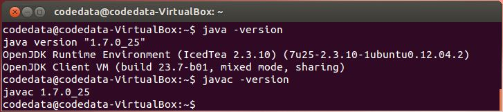

### 練習 2：下載、安裝 Gradle

在 Java 中要開發應用程式，必須撰寫原始碼、編譯、執行，過程中必須指定類別路徑（Class path）、原始碼路徑（Source path），相關應用程式檔案必須使用工具程式建構（Build）以完成封裝與部署（Deploy），嚴謹的應用程式還有測試（Test）等工作階段 …

像這類的工作，在開發過程中可能是有一定且重複性的流程，因而 Java 的世界中提供有建構工具（Build tool）來輔助開發人員，在建構工具中元老級的專案是 [Ant](http://ant.apache.org/)（Another Neat Tool），使用 Ant 在專案結構上有很大的彈性，然而彈性的另一面就是鎖碎的設定 …

另一方面，類似專案會有類似慣例流程，如果能夠提供預設專案及相關慣例設定，對於開發將會有所幫助，這就是 [Maven](http://maven.apache.org/) 後來興起的原因之一，除了提供預設專案及相關慣例設定之外，對於 Java 中程式庫或框架相依性問題，Maven 也提供了集中式貯藏室（Central repository） 解決方案 … 對於相依性管理問題，Ant 也結合了 [Ivy](http://ant.apache.org/ivy/) 來進行解決 …

然而無論是 Ant Ivy、Maven，主要都使用 XML 進行設定，設定繁鎖，而且有較高的學習曲線，以來興趣的 [Gradle](http://www.gradle.org/) 結合了 Ant 與 Maven 的一些好的概念（像是 Task、Repository 等），並使用 Groovy 語言作為腳本設定，在設定上有了極大的簡化，並可以輕易地與 Ant、Maven 進行整合，種種優點吸引了不少開發者，有些重大專案也宣佈改用 Gradle 做為建構工具，像是 Java 領域中著名 ORM（Object-Relational Mapping）框架 [Hibernate](http://www.hibernate.org/) 就在 [Gradle: why?](https://community.jboss.org/wiki/Gradlewhy?_sscc=t) 中宣佈從 Maven 遷移至 Gradle。

考量課程進行的簡易性，這門課中使用 Gradle 是比較適合的，接下來要介紹的，就是 Gradle 的下載與安裝，你可以如下取得 Gradle 最新版本 1.7 並解壓縮：

    $ wget http://services.gradle.org/distributions/gradle-1.7-bin.zip
    $ unzip gradle-1.7-bin.zip

解壓縮之後，會有個 gradle-1.7 目錄，其中 bin 目錄放置了 `gradle` 執行檔，你可以使用 `st2 ~/.bashrc` 指令，編輯 `.bashrc` 中加入環境變數設定 `export PATH="$HOME/gradle-1.7/bin:$PATH"` 並存檔：

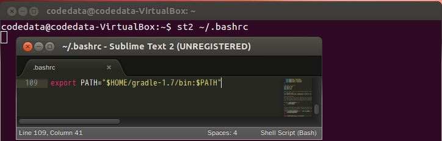

之後重新啟動終端機，就可以使用 `gradle` 指令，可使用 `gradle -v` 得知 Gradle 版本：

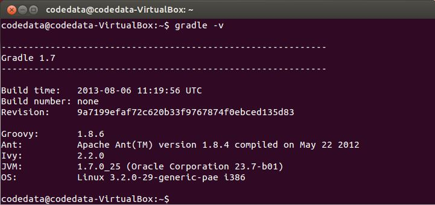

到這邊為止，課程環境大致準備好了，下一門課程就要來實際撰寫、編譯與執行 Java 程式，來看看如何撰寫第一個「哈囉！世界！」。

## 哈囉！世界！

接下來要準備「撰寫、編譯與執行」第一個 Java 程式。**Java 的原始碼副檔名必須是 .java，經由編譯器將之編譯為副檔名為 .class 的位元碼（Bytecode）檔案**。

練習 3：哈囉！世界！

雖然你可以將 Java 原始碼 .java 檔案與編譯出來的 .class 位元碼檔案，放在同一個目錄底下，不過這邊一開始就要你將原始碼與位元碼檔案分開在兩個目錄底下管理，這會讓你一開始就得認識幾個編譯與執行時的引數，也讓第一個程式有些挑戰性。

你可以執行以下指令來建立、進入專案目錄 Hello、原始碼目錄 src、位元碼目錄 classes，並開始編輯第一個 Java 原始碼：

    ~$ mkdir Hello
    ~$ cd Hello
    ~/Hello$ mkdir src
    ~/Hello$ mkdir classes
    ~/Hello$ st2 src/HelloWorld.java

HelloWorld.java 的內容如下，**留意一下你的程式碼中大小寫必須與這邊的範例一致**：

```java
import java.nio.charset.Charset;
import java.io.IOException;
import java.nio.file.*;
import static java.lang.System.*;
 
public class HelloWorld {
    public static void main(String[] args) {
        Path source = Paths.get(args[0]);
        Charset charset = Charset.forName("UTF-8");
        try {
           for(String line : Files.readAllLines(source, charset)) {
               out.println(line);
           }
        } catch(IOException ex) {
           err.println(ex.getMessage());
        }
    }
}
```

編輯完成後存檔，這邊暫不解釋程式碼的細節。附帶一提，練習的程式碼成果，都可以在〈準備課程環境〉中，從 Github 下載的 [JavaTutorial](https://github.com/codedata/JavaTutorial.git) 中取得，舉例來說，這個練習的成果，可以在其中的 labs/solutions/exercise3 中取得。接著你得編譯 src/HelloWorld.java 原始碼，並將編譯後的位元碼儲存為 classes/HelloWorld.class：

    ~/Hello$ javac -d classes src/HelloWorld.java

編譯時使用 `javac` 編譯器，`-d` 引數指定了位元碼的存放位置為 classes，如果編譯成功，classes 中就會出現 HelloWorld.class 檔案。

接著，使用 gedit 編輯任何一個檔案，我這邊存為 hello 檔案：

    ~/Hello$ gedit hello

寫寫一些文字（中文英文都可以）之後存檔，我在裏頭寫著「哈囉！世界！」。嗯？我們不是安裝了 Sublime Text 2 嗎？是沒錯，不過要讓 Sublime Text 2 可以輸入中文，會是另一個故事了（顯示倒是沒問題），所以，這邊還是先使用一下 gedit。接著你可以執行以下指令，來讀取並顯示 hello 檔案中的文字：

    ~/Hello$ java -cp classes HelloWorld hello

執行 `java` 指令是啟動一個 JVM，`-cp` 是 `-classpath` 的縮寫，`CLASSPATH` 是類別路徑，這告訴 JVM，可以至哪些目錄中，找到位元碼檔案。上面的指令指定從 HelloWorld 位元碼檔案的 `main` 開始執行，最後的 hello 是給位元碼檔案的命令列引數（Command line argument），你指定的命令列引數，會依序儲存為 `main` 中的字串陣列元素。如果指令無誤且執行正確，你應該可以看到以下畫面：

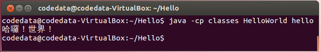

### 練習 4：使用 Gradle 的哈囉！世界！

顯然地，Java 程式必須經過撰寫、編譯、執行這幾個步驟有些麻煩，實際上在編譯 .java 原始碼時，如果有多個 .java 檔案及已經編譯完成的 .class 檔案的話，還必須指定 `-classpath` 及 `-sourcepath`，你可以使用建構（Build）工具來簡化並自動化這個流程，像是使用前一篇文章下載安裝的 Gradle。

為了符合 Gradle 專案的慣例，先依以下指令來調整原始碼的位置：

    ~/Hello$ mkdir -p src/main/java
    ~/Hello$ mv src/HelloWorld.java src/main/java/
    ~/Hello$ rm -r classes

Gradle 的慣例期待你的 .java 原始碼會置放在 src/main/java 目錄中，編譯出來的 .class 檔案會放置在 build\classes\main 中，不過你不用自行建立這個目錄，Gradle 稍後會自行為你建立。

你需要在專案目錄下建立一個 build.gradle 檔案，內容如下：

```groovy
apply plugin: 'java'
apply plugin:'application'
mainClassName = "HelloWorld"
 
run {
    args fileName
}
```

`'java'` 的 `plugin` 為 Gradle 專案加入了 Java 語言的原始碼編譯、測試與打包（Bundle）等能力；`'application'` 的 plugin 則擴充了語言常用的相關任務（Task），像是執行應用程式等；`mainClassName` 指出了從哪個位元碼檔案的 `main` 開始執行。`run` 這個任務中，使用 `args` 指定了執行位元碼檔案時給定的命令列引數。

撰寫並儲存 build.gradle 檔案之後，可以如下執行 Gradle：

    ~/Hello$ gradle run -PfileName=hello

`-PfileName=hello` 指定了 `fileName` 參數的值為 `'hello'`，這也就是先前 `run` 任務中的 `fileName` 參數。如果執行正確無誤，你將可以看到以下畫面（完成後順便檢視專案底下 Gradle 為你產生的 build 目錄中有哪些東西）：

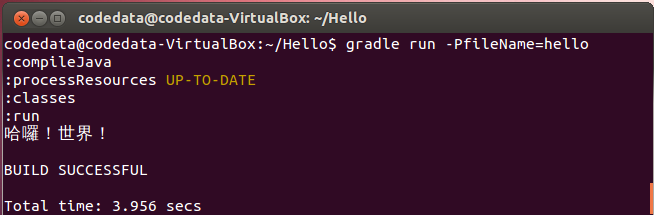

從這邊的兩個練習，你也瞭解了 一個 Java 專案的建立、原始碼的撰寫、位元碼的編譯與執行等基本必要的動作（而不是傻瓜式的哈囉！世界！），也知道如何使用建構工具來簡化、自動化這個過程。

第一堂課差不多快下課了，剩下的時間，我們來瞭解一下剛剛的 HelloWorld.java 寫了什麼。

## 套件、I/O 與例外

接著我們要來看看，第一個 HelloWorld.java 到底寫了什麼，為了方便，將程式碼在這邊再貼一次：

```java
import java.nio.charset.Charset;
import java.io.IOException;
import java.nio.file.*;
import static java.lang.System.*;
 
public class HelloWorld {
    public static void main(String[] args) {
        Path source = Paths.get(args[0]);
        Charset charset = Charset.forName("UTF-8");
        try {
           for(String line : Files.readAllLines(source, charset)) {
               out.println(line);
           }
        } catch(IOException ex) {
           err.println(ex.getMessage());
        }
    }
}
```

這個程式碼就包括了 Java 中套件管理、輸入輸出（Input / Output）、字元編碼與例外處理等的特色，與其只給你一個簡單的 Hello! World! 程式，不如一開始就來面對它們。

- 套件管理

程式開發中會使用到程式庫，程式庫中會包括許多類別，為了避免彼此名稱衝突，也為了避免檔案彼此覆蓋，Java 提到了**套件（Package）**來加以管理，之後還會介紹套件的 `package` 語法與實體架構。目前你需知道的是，在程式中會使用到**全名（Fully qualified name）**為 `java.nio.charset.Charset`、`java.io.IOException` 兩個類別，其中 `java.nio.charset` 與 `java.io` 分別是 `Charset` 與 `IOException` 的套件名稱。不過每次都要打這麼長的名稱，撰寫上過於冗長，因而使用 `import` 語句事先聲明全名，之後程式中就可以使用 `Charset`、`IOException` 來代替全名。

如果有很多個類別都擁有相同的套件名稱，逐一使用 `import` 事先宣告全名也是很累人的事，此時可以在套件名稱之後使用 * 來表示將會用到此套件下數個類別，例如 `import java.nio.file.*`。

在 Java 中可使用套件組織類別之外，**對於一些語言中有的函式（Function），Java 可使用靜態（`static`）方法定義於類別之中**，也就是說，**類別是作為靜態方法的名稱空間（Namespace）**；具體實例就是範例中定義的 `main` 靜態方法，是以 HelloWorld 類別作為名稱空間，**除了靜態方法，也可以定義靜態變數，也就是以類別作為名稱空間的變數**；對於靜態方法或變數，建議以類別名稱來存取，例如 `System.out`。

因此你也可以看出，`Paths.get` 表示了 `get` 是定義在 `Paths` 類別中的靜態方法，而 `Charset.forName` 表示了 `forName` 是定義在 `Charset` 中的靜態方法。

有時類別名稱寫出來會讓程式比較清楚，但有時對程式可讀性沒有幫助時反而顯得太過麻煩，此時可以使用像是 `import static java.lang.System.*` 這樣的方法，來宣告將使用到 `java.lang.System` 下的靜態變數或方法，之後就可以直接以變數名或方法名來進行操作。

- 輸入輸出

Java 的程式進入點是 `public static void main(String[] args)`，為何這麼寫？要給簡單答案的話「這是規定」，要解釋也可以，`main` 是公開（`public`）方法，如此才能在其他套件中取用，它是靜態成員，因此 JVM 就可以在收集好命令列引數（Command line arguments）為一個字串陣列 `args` 後，以 `HelloWorld.main(args)` 來呼叫它。

在 Java 中進行輸入輸出可以基於串流（Stream）程式庫，或是基於高階的 New IO 程式庫，`Files.readAllLines(source, charset)` 就是高階 New IO 程式庫的功能（嚴格來說，這邊用到了 JDK7 增加的 NIO2 功能，在這之前，則是 JDK1.4 增加的 NIO 功能），可以讀取指定來源路徑的內容，依指定字元編碼轉換為字串，傳回 `List` 表示檔案的每一行。知道為何這邊要使用 UTF-8 嗎？在 Ubuntu 12.04 LTS 中，預設文字編碼是 UTF-8。

`for` 迴圈語法可以與 `List` 結合，`for(String line : Files.readAllLines(source, charset))` 的讀法是「對於 `Files.readAllLines`」讀取的每一行，指定給 `line` 變數，然後執行迴圈內容。

迴圈中的 `out` 實際上 `java.lang.System` 中定義的靜態變數 `out`，代表標準輸出（Standard output），通常指終端機，`out.println` 要求在標準輸出中列示一行並產生換行字元。類似地，`err` 是 `java.lang.System` 中定義的靜態變數 `err`，代表標準錯誤（Standard error）輸出。

- 例外

程式中的錯誤總是無所不在，**Java 中對於錯誤的表示，不以某個常數來表示，這也是為何程式進入點宣告為 void 表示不傳回值的原因**。例外（Exception）是 Java 表示錯誤的方式之一，我們可以嘗試（`try`）執行程式區塊，如果有錯誤發生的話，會被包裝為例外物件，如果想要針對錯誤處理，可以捕捉（`catch`）例外。以上例來說，我們嘗試執行：

```java
try {
    for(String line : Files.readAllLines(source, charset)) {
        out.println(line);
    }
}
```

如果 `Files.readAllLines` 真的發生輸入輸出上的錯誤，會拋出 `IOException`，因為程式中指定捕捉該例外：

```
catch(IOException ex) {
    err.println(ex.getMessage());
}
```

如果真的發生錯誤了，就可取得訊息並透過標準錯誤輸出來顯示。只是，我們怎麼知道在這邊要捕捉 `IOException`？因為當初設計 `Files.readAllLines` 方法時，就好心地在方法的原始碼上聲明了，這個方法會拋出 `IOException`，這可以在 [API 文件](http://docs.oracle.com/javase/7/docs/api/java/nio/file/Files.html#readAllLines(java.nio.file.Path, java.nio.charset.Charset)) 查詢到：

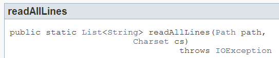

這麼做的好處之一是，**只要查詢文件，不用看原始碼，也可以知道這個方法會拋出什麼例外**，實際上，如果你忘了要處理例外，像是 …

```java
import java.nio.charset.Charset;
import java.nio.file.*;
 
public class HelloWorld {
    public static void main(String[] args) {
        Path source = Paths.get(args[0]);
        Charset charset = Charset.forName("UTF-8");
        for(String line : Files.readAllLines(source, charset)) {
            System.out.println(line);
        }
    }
}
```

忘了要處理宣告的 `IOException` 例外，編譯器也會以編譯失敗來提示你必須處理 `IOException`：

```command
... error: unreported exception IOException; must be caught or declared to be thrown
        for(String line : Files.readAllLines(source, charset)) {
                                            ^
1 error
```


很貼心地設計嗎？實際上，**Java 是唯一採用這種作法的語言**，然而這也是 Java 最常被攻訐的缺點之一，因為這必須造成語法上的繁瑣，在應用程式演化至一定規模時，也會遭遇到設計上的麻煩 ... 

有時你就是不想或無法在現階段處理例外，也得明確地採用某個處理方式，像是使用這邊的 `try-catch`，或是在方法聲明 `throws`，像是在設計 `Files.readAllLines` 方法時，並不會知道到時使用者會在哪個環境中呼叫，因此 `Files.readAllLines` 無法私自處理掉 `IOException`，只好在程式碼上使用 `throws` 宣告 `IOException`，將 `IOException` 的處理權交給呼叫 `Files.readAllLines` 方法的使用者。

無論如何，Java 一直堅持著這樣的例外處理風格，這就成了 Java 的特色了（Java 是門囉囉嗦嗦的語言，只是它有它囉嗦的道理），與其抗拒它，不如正確地認識如何使用它，這會是日後你繼續深入 Java 時必修的課題。

第一堂課的內容就到這邊了，我們認識了 Java 環境的安裝與準備，寫了第一個 Java 程式，瞭解了一些套件管理、輸入輸出以及例外處理等 Java 中特有的特性，休息一下！後面要來進入第二堂課，瞭解更多 Java 語言的細節。

# Java Tutorial 第二堂

第二堂上課囉！在知道怎麼撰寫、執行第一個 Java 程式之後，接下來就要瞭解一下 Java 這個程式語言，只不過我們只剩五個小時，因而採取的方式是，在這一個小時很快地瀏覽過 Java 語言的重要基本元素，之後四個小時再從更多實際的範例中瞭解 Java 語言。

## 語言基本元素

那麼，哪些東西才是語言中重要而基本的元素呢？Pascal 之父 Niklaus E. Writh 曾說過：

> Algorithms + Data Structures = Programs

演算法與資料結構就等於程式，而一門語言提供的資料型態（Data type）、運算子（Operator）、程式碼封裝方式等，會影響演算法與資料結構的實作方式，因此這一堂對於 Java 語言講解的重點將選定在：

- 型態系統、變數（Variable）與運算子（Operator）
- 方法（Method）、類別（Class）與套件（Package）

雖然帶動與普及了物件導向的設計，不過 Java 本身並不是純綷的物件導向語言，像是就型態系統而言，Java 就並非每個值都是物件，就目前版本的 Java 而言，混合了兩個型態系統：**基本型態（Primitive type）**與**物件型態（Object type）**。

Java 中的基本型態就是純綷的值，1 就是 1，0.2 就是 0.2，`true` 就是 `true`，除此之外沒有其他資訊了，基本型態的存在，代表著過去程式設計的主要目的：進行數學運算。某些程度上，基本型態是 Java 這種命令式（Imperative）語言中存在的函數式（Functional）元素，因為 1 就是 1，你沒有辦法改變它，1 + 2 是一個數學操作，結果是產生新的值 3。

Java 支援物件導向，物件型態就是另一型態系統，物件是由一組相關的狀態，以及支援狀態的操作組成。對於基本型態，Java 亦有對應的包裹器（Wrapper）型態，可配合需要物件的場合。過去曾經討論過，在未來的版本中也許會拿掉 Java 中基本型態，只留下物件型態，不過現階段而言，基本型態與物件型態還是並存的，兩種都必須瞭解。

型態眾多，對於初學一門語言來說，或說對於學習 Java 語言來說，這邊將著重在以下幾個型態之介紹：

- 數值型態（Numeric type）
- 字元（Char）、字串型態（String type）
- 容器型態（Container type）

接下來，我們要先來認識數值型態與字串型態，而數值型態中會一併介紹基本型態與對應的物件型態。

## 數值型態

在基本型態中，依需要的資料長度不同，整數可以使用 `byte`（單位元組）、`short`（雙位元組）、`int`（四位元組）與 `long`（八位元組）型態。基本上，沒有特定需求（像是處理位元資料、時間戳記等），多半使用 `int` 整數。

**如果僅寫下 1 這樣的實字（Literal），會是 `int` 型態**；如果實字指定給變數，實字數值若在變數型態可裝載範圍內，則會將數值儲存至變數，如果不行就會編譯錯誤；

```java
byte number1 = 1;
byte number2 = 128; // error: possible loss of precision
```

Java 中不會自動使用 `long` 來儲存較長的整數實字，如果想要寫下的實字是 `long` 型態，必須在實字後加上 `L`，透過以下這個例子會比較清楚：

```java
long number1 = 12345678987654321L;
long number2 = 12345678987654321; // error: integer number too large: 12345678987654321
```

`long` 型態是可以容納 12345678987654321 的，第二行編譯錯誤的原因是在於編譯器發現用 `int` 裝不下 `12345678987654321` 這個實字，而不是 `long` 型態的變數 `number2` 裝不下 `12345678987654321`。

那麼超過 `long` 可容納範圍的數要怎麼表示？像是 `9223372036854775808L` 是會編譯錯誤的！Java 使用 **`java.math.BigInteger`** 來解決。例如要表示數學運算 `9223372036854775808 + 9223372036854775808` 的結果，可以如下：

```java
import java.math.BigInteger;
import static java.lang.System.out;
 
public class Cal {
    public static void main(String[] args) {
        BigInteger x = new BigInteger(args[0]);
        BigInteger y = new BigInteger(args[2]);
        switch(args[1]) {
            case "+": out.println(x.add(y)); break;
            case "-": out.println(x.subtract(y)); break;
            case "x": out.println(x.multiply(y)); break;
            case "/": out.println(x.divide(y));
        }
    }
}
```

`switch` 從 JDK7 開始，可以支援字串，在這之前，僅支援整數、字元與列舉（Enum），這個程式可以進行簡單的加、減、乘、除運算，像是…

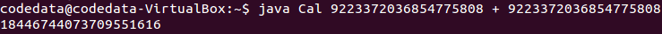

如果需要將基本型態包裝為物件型態，可以直接使用對應的 `Byte`、`Short`、`Integer` 與 `Long` 包裹器（Wrapper）類別，像是：

```java
Integer x = 10;
Integer y = 20;
Integer z = x + y;
```

這當中有一些語法蜜糖，目的在讓你使用這些包裹器類別時，如同使用基本型態一樣的方便。

在基本型態中，依需要的資料精確度不同，浮點數可以使用 `float`（四位元組） 與 `double`（八位元組）兩個型態。**在程式中寫下像是 0.3 這樣的浮點數實字，會使用 `double` 型態**，因此 …

```java
double number1 = 0.3;
float number2 = 0.3; // error: possible loss of precision
```

如果想要使用 `float` 型態，有兩種方式，一是在實字上指定 `F`，表示這個浮點數要使用 `float`，另一種方式就是用所謂的轉型（Cast）語法叫編譯器別囉嗦：

```java
float number1 = 0.3F;
float number2 = (float) 0.3;
```

**在數值前加上一個型態限定，通常被稱之為轉型，實際上，這就是關閉編譯器在此處的型態檢查**，這樣編譯器就會乖乖地完成編譯，只不過你如果要編譯器在編譯時別那麼囉嗦，那執行時期如果 `double` 的值真的超過了 `float` 變數可容納的範圍，那就只能硬裝進去了，也就是多出來的位元組會被切掉，也就是會有精度遺失問題。

多數 CPU 與浮點運算器多採用 [IEEE754 浮點數運算（IEEE 754 floating-point arithmetic）](http://zh.wikipedia.org/wiki/IEEE_754)，某些浮點數本身就有誤差，這是每個程式人都應該知道的事。像是 1.0 – 0.8 在程式中不會是 0.2，是電腦科學中違反數學的例子之一：

```java
System.out.println(1.0 - 0.8); // 顯示 0.19999999999999996
```

如果你需要精確度，程式中不應當使用浮點數來直接進行運算，尤其是要避免「[算錢用浮點，遲早被人扁](https://www.facebook.com/codedata.tw/posts/531921813556596)」的可能性發生，在需要浮點數精度的時候，Java 中可以使用 **`java.math.BigDecimal`**，例如：

```java
import java.math.BigDecimal;
import static java.lang.System.out;
 
public class Cal {
    public static void main(String[] args) {
        BigDecimal x = new BigDecimal(args[0]);
        BigDecimal y = new BigDecimal(args[2]);
        switch(args[1]) {
            case "+": out.println(x.add(y)); break;
            case "-": out.println(x.subtract(y)); break;
            case "x": out.println(x.multiply(y)); break;
            case "/": out.println(x.divide(y));
        }
    }
}
```

這個例子不過是將前一個計算大整數的程式，把 `BigInteger` 改為 `BigDecimal`，以支援浮點數精度，一個使用的例子是…
 
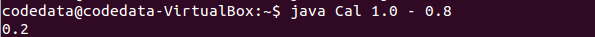

## 字元、字串型態

字串是由字元組成，在 Java 中要表示字元，必須使用單引號來包裹，像是 `'A'`、`'程'` 就表示字元，型態是 `char` 基本型態。**Java 支援 Unicode，內部實作採用 UTF-16 Big Endian**，也就是說，無論中英文字元，都會使用兩個位元組，這也就是為何在入門階段，不用特別在意原始碼文字編碼問題處理的原因。由於單引號被用來表示一個字元實字，因此如果想要表示單引號字元的話，就必須使用略過（Escape）字元 `\`，也就是 `'\''`，而為了表示略過字元，則必須使用 `'\\'`。

如果要表示一串字元，也就是字串的話，Java 中使用雙引號來包裹，像是 `"codedata"`、`"程式"` 就表示字串，當然，如果字串中必須表示雙引號，也必須使用略過字元，像是 `"\"Code\" & \"Data\""`。

**Java 中的字串不可變（Immutable）**，你無法改變已建立的字串內容，字串是 `String` 類別的實例，因此可以使用 `String` 類別上定義的各個方法，像是以 `length` 方法得知字串中的字元個數，使用 `contains` 得知字串是否包括某個子字串，使用 `substring` 來進行字串切割等，要進行字串的串接，可以直接使用 `+`。

```java
import static java.lang.System.out;
 
public class Main {
    public static void main(String[] args) {
        String name = "codedata";
 
        out.println(name.length());          // 8
        out.println(name.contains("coded")); // true
        out.println(name.charAt(3));         // e
        out.println(name.substring(2, 5));   // ded
        out.println(name + name);            // codedatacodedata
 
        char[] characters = name.toCharArray();
        for(char ch : characters) {
            out.printf("%c ", ch);  // c o d e d a t a
        }
    }
}
```

在 Java 中，只有陣列與具有 `Iterable` 行為的物件，才能運用 for-each 語法，因而範例中使用 `toCharArray` 取得字元陣列，再透過 for-each 語法逐一取得陣列中的字元並顯示。`System.out` 的 `printf` 方法可以進行字串格式化再輸出，`%c` 佔位符號表示這邊將會有個字元。`String` 有個 `static` 方法 `format`，也可以進行字串格式化，傳回新的字串。例如：

```java
String desc = String.format("(%d %.2f %s)", 1, 99.3, "codedata");
System.out.println(desc); // (1 99.30 codedata)
```

格式化字串時所需要的語法，可以參考 〈[Format String syntax](http://docs.oracle.com/javase/7/docs/api/java/util/Formatter.html#syntax)〉。

談到這邊該注意的是，**Java 中若要比較兩個基本型態，可以使用 `==`，然而要比較兩個物件的狀態是否相同，則需透過物件上定義的 `equals` 方法**。例如：

```java
import static java.lang.System.out;
 
public class Welcome {
    public static void main(String[] args) {
        if(args[0].equals("codedata")) {
               out.println("Hi, Admin!");
        } else {
               out.printf("Welcome, %s%n", args[0]);
        }
    }
}
```

以下是這個程式原本想要的情況：

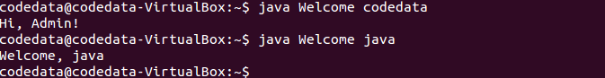

然而，如果將程式中 `if(args[0].equals("codedata"))` 改為 `if(args[0] == "codedata")`，結果就會是如下，再也看不到親切的站長問候：

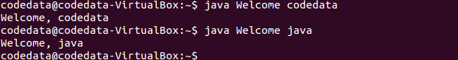

其實，`==` 的本質上其實並沒有改變，它還是僅比較兩邊的值，如果 `==` 兩邊是基本型態，比較兩邊值是否相等，如果 `==` 兩邊是物件，也是比較兩邊值是否相等，只不過這個值不是指物件的狀態，而是指參考（Reference）。

本來嘛！要比較兩個物件的狀態，該怎麼比，本來就該定義，Java 中就是使用 `equals` 方法來定義，只不過 Java 中使用 `==` 比較物件時，不會像有的程式語言會自動去呼叫 `equals` 方法，在 Java 中，得明確地呼叫 `equals` 來比較物件狀態。

有關物件相等性更多的說明，可以參考 〈[物件相等性（上）](http://www.codedata.com.tw/java/object-equality-1/)〉 的文章。

## 容器型態

想想你平時撰寫的一些應用程式，大部份是在處理一組資料，Java 對管理資料用的容器（Container）型態，在語法上提供直接支援的只有陣列，其餘則是以程式庫的形式存在，除了標準程式庫之外，還有各式開放原始碼程式庫可供選擇。

在這邊將會介紹 Java 中的陣列、`List`、`Set`，在鍵（Key）值（Value）結構的型態上，則介紹 `Map`。除了標準 API 的容器類別實作之外，還介紹了 guava-libraries 的 Collections 實作。

- 陣列型態

Java 目前唯一在語法上提供支援的是陣列，**如果你需要容量固定且有序的容器，就可以使用陣列**。例如 `Integer[] numbers = {1, 2, 3};`，可以建立容量為 3 的陣列而索引為 0、1、2 的陣列。

在 Java 中陣列是物件，雖然如此，基本上與陣列有關的屬性只有 `length`，可用來取得陣列的容量。如果你想對陣列做任何其他操作，可以使用 `java.util.Arrays` 提供的 `static` 方法。像是使用 `fill` 於陣列中填充元素、使用 `copyOf` 來複製陣列等簡單操作，若是需要更多對容器的操作，建議使用其他容器型態。

- `List` 型態

**如果需要有序具索引特性的容器，且需要比陣列擁有更多功能，可以使用 `List`**，這個型態定義在 `java.util` 套件中。如果已知有若干元素，可以使用 `java.util.Arrays` 提供的 `static` 方法 `asList` 來建立 `List` 實作物件。例如：

```java
List<Integer> numbers = Arrays.asList(1, 2, 3);
```

如果事先不知道要收集哪些元素，可以直接建立 `List` 的實作物件，**你完全可以視需求採用適當資料結構實作的物件**，像是內部實作採陣列的 `ArrayList`、採鏈結的 `LinkedList` 等標準 API 中定義的物件，甚至是來自開放原始碼的 `List` 實作物件，像是後續會介紹的 guava-libraries。例如，如果你需要在收集之後，擁有較好的索引存取效率，可以採用 `ArrayList`。

```java
List<Integer> numbers = Arrays.asList(1, 2, 3);
List<Integer> collector = new ArrayList<>();
collector.add(10);
collector.addAll(numbers);
collector.size(); // 4
```

在上面的範例中，由於宣告 `collector` 時已經指定了 `List<Integer>`，表示要收集的元素都是 `Integer`，因此建構實作物件 `ArrayList` 時，就不用於 `<>` 中再指定 `Integer` 型態，編譯器會自行由 `collector` 的型態中推斷，`ArrayList` 中裝載的型態是 `Integer`，實際上這是 JDK7 之後的新功能，在之前版本，你必須明確地定義為 `List<Integer> collector = new ArrayList<Integer>()`。

- `Set` 型態

`Set` 型態是無序群集（Collection），管理的元素不會重複，照例地，你可以擁需求選用適當的資料結構實作物件，像是基於雜湊（Hash）的 `HashSet`，或者是基於紅黑樹實作的 `TreeSet`。以下是使用 `Set` 來模彷 [Python Tutorial 第二堂（2）](http://www.codedata.com.tw/python/python-tutorial-the-2nd-class-2-container-flow-for-comprehension/) 中 `set` 的示範：

```java
import java.util.*;
import static java.lang.System.out;
 
public class Main {
    public static void main(String[] args) {
        Set<String> admins = new HashSet<>(Arrays.asList("Justin", "caterpillar"));
        Set<String> users = new HashSet<>(Arrays.asList("momor", "hamini", "Justin"));
 
        out.println(admins.contains("Justin")); // 是否在站長群？true
 
        Set<String> intersection = new HashSet<>(admins);
        intersection.retainAll(users); // 同時是站長群也是使用者群的？
        out.println(intersection);  // [Justin]
 
        Set<String> union = new HashSet<>(admins);
        union.addAll(users);  // 是站長群或是使用者群的？
        out.println(union);  // [momor, hamini, Justin, caterpillar]
 
        Set<String> adminsButNotUsers = new HashSet<>(admins);
        adminsButNotUsers.removeAll(users);  // 站長群但不使用者群的？
        out.println(adminsButNotUsers);  // [caterpillar]
 
        Set<String> xor = new HashSet<>(union);
        xor.removeAll(intersection);  // xor
        out.println(xor); // [momor, hamini, caterpillar]
 
        out.println(admins.containsAll(users));  // ∈，false
        out.println(users.containsAll(admins));  // false
    }
}
```

除了 `List`、`Set` 本身定義的操作之外，有些操作可以在 `java.util.Collections` 的 `static` 方法找到。

- `Map` 型態

鍵值對應的物件，在 Java 中可使用 `Map` 型態，你可以依需求選用適當的資料結構實作，像是 `HashMap`、`TreeMap` 等，以下是模彷 [Python Tutorial 第二堂（2）](http://www.codedata.com.tw/python/python-tutorial-the-2nd-class-2-container-flow-for-comprehension/) 中 `dict` 的示範：

```java
import java.util.*;
import static java.lang.System.out;
 
public class Main {
    public static void main(String[] args) {
        Map<String, Integer> passwords = new HashMap<>();
        passwords.put("Justin", 123456);
        passwords.put("caterpillar", 93933);
 
        out.println(passwords.get("Justin")); // 123456
 
        passwords.put("Hamimi", 970221);  // 增加一對鍵值
        out.println(passwords);  // {Justin=123456, caterpillar=93933, Hamimi=970221}
 
        passwords.remove("caterpillar");  // 刪除一對鍵值
        out.println(passwords);  // {Justin=123456, Hamimi=970221}
 
        out.println(passwords.entrySet()); // [Justin=123456, Hamimi=970221]
        out.println(passwords.keySet());   // [Justin, Hamimi]
        out.println(passwords.values());   // [123456, 970221]
    }
}
```

- Guava Collections

Java 標準 API 的容器物件，著重在功能性的定義與實作，少於考量易用性，加上 Java 本身又是靜態定型（Statically-typed）語言，不少地方都需要型態宣告，因而使用上就現今眼光來說，頗為不便。**Java 的世界中有不少的開放原始碼程式庫，可以補強 Java 在這方面的不足**，在這邊使用一下 [guava-libraries](https://code.google.com/p/guava-libraries/) 的 Collections，讓需求在操作上比較方便一些。

### 練習 5：使用 Guava Collections

在這個練習中，將使用 Guava Collections 來改寫先前的一些範例，不過在急著到 Guava 官方網站下載相關 jar 檔案之前，別忘了我們有安裝 Gradle，它可以自動幫你下載 jar 檔案，為此，先在使用者目錄下建立一個 Collections 目錄與 Gradle 慣例的相關子目錄：

    ~$ mkdir Collections
    ~$ cd Collections
    ~/Collections$ st2 build.gradle
    ~/Collections$ mkdir -p src/main/java
    ~/Collections$ st2 build.gradle

最後一個指令建立了 build.gradle 檔案，你可以如下撰寫，使用 `'java'`、`'application'` 的 plugin，設定 `mainClassName`，下載 jar 檔案的來源，以及你想要下載的程式庫名稱、版本等。

```groovy
apply plugin: 'java'
apply plugin:'application'
mainClassName = "Main"
 
repositories {
  mavenCentral()
}
 
dependencies {
  compile group: 'com.google.guava', name: 'guava', version: '15.0'
}
```

接著編輯 Main.java

    ~/Collections$ st2 src/main/java/Main.java

內容如下：

```java
import java.util.*;
import com.google.common.collect.*;
import static java.lang.System.*;
 
public class Main {
    public static void main(String[] args) {
        // List Demo
        List<Integer> numbers = Arrays.asList(1, 2, 3);
        List<Integer> collector = 
            ImmutableList.<Integer>builder()
                         .add(10)
                         .addAll(numbers)
                         .build();
 
        out.println(collector.size()); // 4
 
        // Set Demo
        Set<String> admins = ImmutableSet.of("Justin", "caterpillar");
        Set<String> users = ImmutableSet.of("momor", "hamini", "Justin");
 
        out.println(admins.contains("Justin")); // 是否在站長群？true
        out.println(Sets.intersection(admins, users)); // 同時是站長群也是使用者群的？ [Justin]
        out.println(Sets.union(admins, users)); // 是站長群或是使用者群的？ [Justin, caterpillar, momor, hamini]
        out.println(Sets.difference(admins, users)); // 站長群但不使用者群的？ [caterpillar]
        out.println(Sets.symmetricDifference(admins, users)); // xor [caterpillar, momor, hamini]
        out.println(admins.containsAll(users));  // ∈，false
        out.println(users.containsAll(admins));  // false*/
 
        // Map Demo
        Map<String, Integer> passwords = ImmutableMap.of("Justin", 123456, "caterpillar", 93933);
 
        out.println(passwords.get("Justin")); // 123456
        out.println(passwords.entrySet()); // [Justin=123456, Hamimi=970221]
        out.println(passwords.keySet());   // [Justin, Hamimi]
        out.println(passwords.values());   // [123456, 970221]
    }
}
```

比較一下與先前範例的差別，看看有沒有比較方便與清楚一些，然後執行 `gradle run`：

    ~/Collections$ gradle run

第一次執行時，Gradle 會自動下載 jar 檔案，然後進行編譯與執行，你應該看到以下結果：

    4
    true
    [Justin]
    [Justin, caterpillar, momor, hamini]
    [caterpillar]
    [caterpillar, momor, hamini]
    false
    false
    123456
    [Justin=123456, caterpillar=93933]
    [Justin, caterpillar]
    [123456, 93933]

如果想要瞭解更多有關 Guava Collections 或更多 guava-libraries 的介紹，可以參考 [Guava 教學](http://www.codedata.com.tw/forum/viewthread.php?tid=116&extra=page%3D1)。

## 流程語法

流程語法中最簡單的 `if..else` 分支判斷，在 Java 中是這樣寫的：

```java
if(args.length > 1) {
    out.println("Hello, " + args[0]);
} else {
    out.println("Hello, Guest");
}
```

Java 中的 `if..else` 是陳述（Statement），有個類似運算式（Expression）形式是三元運算子 `?:`。`?` 前的條件式成立的話，會傳回 `:` 左邊的值，否則傳回 `:` 右邊的值。例如上面的程式也可以寫為：

```java
out.printf("Hello, %s%n", args.length > 1 ? args[0] : "Guest")
```

如果想要比對的是某些值，在 Java 中可以使用 `switch`，它可以用在整數、字串、字元等的比對。例如在〈數值型態〉中就看過字串的比對：

```java
...
    switch(args[1]) {
        case "+": out.println(x.add(y)); break;
        case "-": out.println(x.subtract(y)); break;
        case "x": out.println(x.multiply(y)); break;
        case "/": out.println(x.divide(y));
    }
...
```

`while` 迴圈可以使用在結束條件不確定的情況下。例如求最大公因數可以如下：

```java
public class GCD {
    public static void main(String[] args) {
        int m = Integer.parseInt(args[0]);
        int n = Integer.parseInt(args[1]);
        while(n != 0) {
            int r = m % n;
            m = n;
            n = r;
        }
        System.out.printf("GCD: %d%n", m);
    }
}
```

`for` 通常用來進行索引相關的迴圈，例如指定索引迭代命令列引數：

```java
for(int i = 0; i < args.length; i++) {
    out.println(args[i]);
}
```

從頭至尾循序存取是很常見的需求，這邊介紹到的陣列、`List`、`Set` 等，其實都可以使用 foreach 語法，將元素從頭至尾循序迭代：

```java
for(String arg : args) {
    out.println(arg);
}
```

實際上，只要是具備 **`java.lang.Iterable`** 行為的物件，都可以搭配 foreach 語法，像是〈哈囉！世界！〉中使用到的 `Path` 實例，就可以搭配 foreach 來迭代路徑資訊。

### 練習 6：使用 foreach 迭代路徑

**在 Java 中，可以查看 API 文件，確認物件是否擁有某些行為**。舉例來說，想瞭解 `List` 是否為一種 `Iterable`，可以查看 [`List` 的 API 文件](http://docs.oracle.com/javase/7/docs/api/java/util/List.html)：

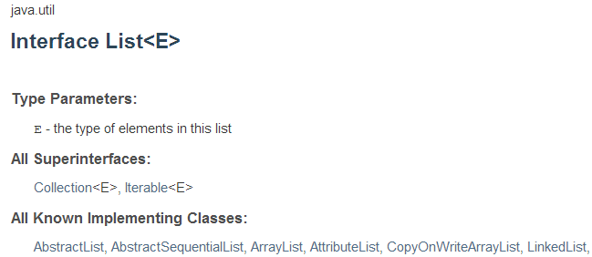

在 All Superinterfaces 上，可以看到 `Iterable`，這表示 `List` 也是一種 `Iterable`。如果想知道總共有哪些物件具有 `Iterable` 的行為，則可以查看 [`Iterable` 的 API 文件](http://docs.oracle.com/javase/7/docs/api/java/lang/Iterable.html)，看看它的 All Know Implementing Classes 有哪些。

類似地，查看一下 `Path` 的 API 文件，可以發現它也是一種 `Iterable`，因此可以撰寫一個程式如下：

```java
import java.nio.file.*;
 
public class ForEach {
    public static void main(String[] args) {
        for(Path parent : Paths.get(args[0])) {
            System.out.println(parent);
        }
    }
}
```

這個程式可以接受命令列引數，你可以指定一個目錄，程式將會將每個子路徑顯示出來，你可以使用 `javac` 編譯、`java` 來執行，或者是使用至目前為止習得的 Gradle 工具來建構程式並執行。

## 架構程式的思考點

Java 中並非每個值都是物件，不過 **Java 基本上是個以物件導向為主要典範的語言**，任何程式都以定義類別為出發點，即使只是個「哈囉！世界！」也不例外：

```java
public class HelloWorld {
    public static void main(String[] args) {
        System.out.println("哈囉！世界！");
    }
}
```

不過這看來不太像物件導向，若只是這樣的需求，似乎也不需要動用到物件導向，如果 Java 具有其他語言中函式（Function）的概念，不是可以更簡單一些，呼叫個 `println("哈囉！世界！")` 就解決這個問題嗎？直接從類別定義出發，再定義靜態方法（Static method），對一些簡單需求來說，確實是不必要，不過就程式的組織與架構上，Java 的作法與一些語言並沒有差別，只不過要求你明確定義類別及定義方法罷了，這篇文章後續會說明這點。

基本上，無論採用何種典範，關鍵在於架構程式時應思考的幾個重點，像是…

**- 抽象層的封裝與隔離
- 物件的狀態
- 名稱空間（Namespace）
- 資源的實體組織方式，像是原始碼檔案、套件（Package）等**

只有在腦海中清楚地思考過這幾個重點，才能在程式語言中採用適當的機制來加以實現，或者是在程式語言不支援時，想辦法自行實作類似機制，像是在 JavaScript 中，即使沒有名稱空間及套件機制，仍有開發者依各自需求實現各種風格的機制，來解決對應的問題。

幸運地，Java 中對於這幾個思考重點，在實作時提供的機制算是為完整，提供了像是靜態方法、類別（Class）與套件等支援。

## 靜態方法

不管你願不願意，想撰寫第一個可執行的 Java 程式，就一定得接觸靜態方法，因為程式進入點就規定一定得是 `public static void main(String[] args)`，而且必須定義在類別之中，在初學階段，對於靜態方法可以先理解為，它就像是其他語言中的函式。舉例而言，當發現到兩個程式片段極為類似，只有當中幾個計算用到的數值或變數不同時，例如 `main` 中可能如此撰寫：

```java
...
Integer max1 = a > b ? a : b;
...
Integer max2 = x > y ? x : y;
...
```

可以使用靜態方法來封裝程式片段，將流程中引用不同數值或變數的部份設計為參數，例如：

```java
/* 存為 Math.java */
class Math {
    static Integer max(Integer a, Integer b) {
        return a > b ? a : b;
    }
}
```

靜態方法得定義在類別之中，如此一來，就可以在其他地方透過類別名稱來呼叫靜態方法，例如 `main` 中可直接如下呼叫：

```java
...
Integer max1 = Math.max(a, b);
...
Integer max2 = Math.max(x, y);
...
```

**就某些程度上，包括靜態方法的類別充當了名稱空間**，就像是 Python 中模組之作用，而類別中的靜態方法，就像是 Python 中的函式，而函式是一種抽象，對流程的抽象，因此如上定義了 `Math.max` 靜態方法之後，客戶端對求最大值的流程，被抽象為 `Math.max(x, y)` 這樣的呼叫，求值流程實作被隱藏了起來。

Java 中有一些 API，就是以這樣的概念來實現，像是 `java.lang.Math` 中就有大量與數學相關的靜態方法，而想到陣列操作時，也可以看看 `java.util.Arrays` 中有沒有現成的靜態方法可以使用，**當想操作的功能不渉及狀態時，可以考慮使用靜態方法**，就像是這邊的 `Math.max`，因為傳入的兩個值是平等的，跟任何物件的狀態沒有關係。

那麼 Java 中的靜態方法，就只是函式的概念嗎？不！不只是這樣的，這篇文章稍後，馬上就可以看到靜態方法的其他應用 ...

## 類別

如果只是將類別拿來當作靜態方法的名稱空間，並不是什麼物件導向，那類別的應用場合呢？…嗯…在你想要表達一組相關聯的數據時，例如，若你想表達帳戶資料，而帳戶有名稱、帳號與餘額，**為了易於操作**，可定義類別將它們視為一個整體：

```java
/* 存為 Account.java */
class Account {
    String name;
    String number;
    Integer balance;
}
```

這麼一來，就使用 `new Account()` 來建立物件並進行操作，也許一開始，你是定義了一些靜態方法來建立與操作 `Account` 實例：

```java
/* 存為 Bank.java */
class Bank {
    static Account account(String name, String number, Integer balance) {
        Account acct = new Account();
        acct.name = name;
        acct.number = number;
        acct.balance = balance;
        return acct;
    }
 
    static void deposit(Account acct, Integer amount) {
        if(amount <= 0) {
             throw new IllegalArgumentException("amount must be positive");
         }
         acct.balance += amount;
     }
 
    static void withdraw(Account acct, Integer amount) {
        if(amount > acct.balance) {
            throw new RuntimeException("balance not enough");
        }
        acct.balance -= amount;
    }
 
    static String toStr(Account acct) {
        return String.format("Account(%s, %s, %d)", 
                          acct.name, acct.number, acct.balance);
    }
}
```

當中是有關於帳戶建立、存款、提款等函式，你會這麼使用：

```
public class Main {
    public static void main(String[] args) {
        Account acct = Bank.account("Java", "001", 100);
        Bank.deposit(acct, 500);
        Bank.withdraw(acct, 200);
        System.out.println(Bank.toStr(acct));
    }
}
```

實際上，`Bank` 類別中的靜態方法，都是與傳入的 `Account` 實例，也就是代表帳戶狀態的物件相關，每個靜態方法的第一個參數是 `Account`，就暗示了這些方法應該與 `Account` 類別放在一起，**何不將相關的狀態與操作黏在一起呢？這樣比較容易使用些**，因此你重新定義了 `Account` 類別：

```java
class Account {
    private String name;
    private String number;
    private Integer balance;
 
    Account(String name, String number, Integer balance) {
        this.name = name;
        this.number = number;
        this.balance = balance;
    }
 
    void deposit(Integer amount) {
        if(amount <= 0) {
             throw new IllegalArgumentException("amount must be positive");
        }
        this.balance += amount;
    }
 
    void withdraw(Integer amount) {
        if(amount > this.balance) {
           throw new RuntimeException("balance not enough");
        }
        this.balance -= amount;
    }
 
    String toStr() {
        return String.format("Account(%s, %s, %d)", 
                         this.name, this.number, this.balance);
    }
}
```

在 `Account` 類別中，**與類別名稱同名且沒有宣告傳回值型態的方法，稱之為建構式（Constructor），它定義了物件的初始流程**，取代了原本的 `account` 靜態方法，注意到每個類別中的方法沒有宣告 `static`，這表示它是個實例方法，**方法中的 `this` 表示物件本身**，如果沒有與參數名稱衝突的話，基本上可以省略，不過有時寫出來比較清楚易懂。

我們希望客戶端必須透過 `deposit`、`withdraw` 等操作物件，而不是直接存取物件的 `name`、`number` 與 `balance` 等狀態成員，這樣 `deposit`、`withdraw` 中設定的流程控管才有意義，因此在 `name`、`number` 與 `balance` 等狀態成員上設定了 `private`，表示這只能是類別內部的程式碼才能存取。

如此定義之後，**客戶端在使用上就容易得多了**…

```java
public class Main {
    public static void main(String[] args) {
        Account acct = new Account("Java", "001", 100);
        acct.deposit(500);
        acct.withdraw(200);
        System.out.println(acct.toStr());
    }
}
```

是的！容易使用！在討論物件導向時，大家總是愛談可重用性（Reusability），然而要談到重用性的話，函式的重用性還高上許多，在考量物件導向時，**易用性（Usability）**其實才是它的重點。

假設現在你有一些 .java 與編譯完成的檔案，別人同樣也有一堆 .java 與 .class 檔案，你們的檔案現在得放在同一專案中，那麼檔案名稱衝突是有可能發生的，最好是為你們的 .java、.class 檔案分別開設目錄；另一方面，只使用外部類別充當名稱空間，也不是好的作法，當多個名稱空間階層時，就會有許多不便。

使用 Java 時，你可以在原始碼開頭使用 `**package**` 來宣告套件階層。例如，想將你的 `Account` 宣告在 `tw.codedata.bank` 套件階層之下的話，可以如下：

```java
package tw.codedata.bank;
 
public class Account {
    private String name;
    private String number;
    private Integer balance;
 
    public Account(String name, String number, Integer balance) {
        this.name = name;
        this.number = number;
        this.balance = balance;
    }
 
    public void deposit(Integer amount) {
        if(amount <= 0) {
             throw new IllegalArgumentException("amount must be positive");
        }
        this.balance += amount;
    }
 
    public void withdraw(Integer amount) {
        if(amount > this.balance) {
            throw new RuntimeException("balance not enough");
        }
        this.balance -= amount;
    }
 
    public String toString() {
        return String.format("Account(%s, %s, %d)", 
                          this.name, this.number, this.balance);
    }
}
```

使用 `package` 宣告 `Account` 是在 `tw.codedata.bank` 意謂著幾件事，如果在其他套件中使用它，必須使用**類別全名** `tw.codedata.bank.Account`，Account.java 必須放置在原始碼路徑（SOURCEPATH）（可使用 `javac` 的 `-sourcepath` 指定）的 tw/codedata/bank 目錄中，編譯完成的 Account.class 必須放在類別路徑（CLASSPATH）的 tw/codedata/bank 目錄中，在遵守這幾件規範，以及好的階層命名下，可以減少名稱空間檔案與衝突的發生。

注意，程式中宣告了 **`public`**，這意謂著被公開的類別或方法對其他套件中的程式碼來說是有用的，沒有宣告任何權限時，預設並不會對其他套件公開這些資訊，只能在相同套件中使用。

在類別中還定義了 **`toString`** 方法來取代 `toStr`，許多程式庫若想要取得物件的字串說明，都會透過 `toString` 方法，例如 `System.out.println` 方法，如果給它個物件，都就會自動呼叫物件的 `toString`，然再用取得的字串進行文字輸出。

假設你在先前的 Main.java 中宣告套件：

```java
package tw.codedata;
 
import tw.codedata.bank.Account;
 
public class Main {
    public static void main(String[] args) {
        Account acct = new Account("Java", "001", 100);
        acct.deposit(500);
        acct.withdraw(200);
        System.out.println(acct);
    }
}
```

因為類別全名為 `tw.codedata.bank.Account` 打來有些冗長，因此這邊使用 `import tw.codedata.bank.Account` 先聲明了後續的 `Account` 應該會是 `tw.codedata.bank.Account`，同樣的，這個 Main.java 與編譯出來的 Main.class 要各自放在原始碼路徑與類別路徑的 tw/codedata 目錄下。

### 練習 7：運用類別與套件來組織程式

在練習用的檔案中，有個 exercises/exercise7/Bank 目錄，這個目錄符合 Gradle 架構，裏頭草草寫了一些類別與靜態方法，以及執行結果輸出的程式碼，請利用這邊介紹的類別與套件等語法，來重新組織當中可重用的程式碼，讓它們可以位於 tw.codedata、tw.codedata.bank 套件中的適當類別。

最後，你完成的程式在實體架構上，應該會像是以下的圖片示意（如果不知道怎麼完成實作，記得參考練習用檔案中 solutions/exercise7/Bank 的成果 ）：

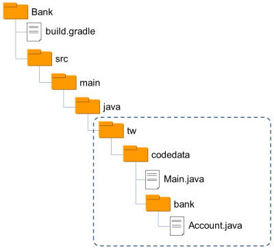

## 再看靜態方法

實際上，Java 的靜態方法並非只是將外部類別作為名稱空間，常見的運用之一是將靜態方法用來隱藏物件實作與建構細節，像是 Guava 的 `ImmutableList`，實際上你並不用去知道實作類別有哪些，也因此也不用想辦法使用 `new` 來建構實例，而是透過 `of` 靜態方法來取得 `ImmutableList` 實例。

類似的應用還有實現單例（Singleton），例如 Java 中的 `java.lang.Runtime` 類別實作如下：

```java
public class Runtime { 
    private static Runtime currentRuntime = new Runtime(); 
 
    public static Runtime getRuntime() { 
        return currentRuntime; 
    } 
 
   /** Don't let anyone else instantiate this class */
   private Runtime() {} 
 
    // 略 ...
}
```

建構式被設為 `private`，因此 `Runtime` 類別以外的程式碼都不能建構它的實例，只有 `Runtime` 類別內部可以建立實例，也因此，實現了每個 JVM 執行時都有唯一的 `Runtime` 實例。

第二堂時間差不多到了，休息一下，接下來的第三堂課要來認識 Java 的 IDE、社群、文件以及更多的 API …

# Java Tutorial 第三堂

在文字模式下編寫 Java 程式，即使透過優秀的文字編輯器以及建構工具的輔助，實際上你還是會遇上一些麻煩的事情，例如在採用 Gradle 作為建構工具的情況下，你還是得自行建立專案目錄、安排建構檔案內容，在瞭解 Java 中套件結構之後，你還得為套件建立對應的目錄階層等 … 有幾個方式可以解決這些麻煩，一是透過整合開發工具（Integrated Development Environment, IDE），二是編寫建構檔案內容，讓上述過程也可以自動化。

## 整合開發工具

IDE 與建構工具在某些功能上或許有些重疊，但基本上並不衝突，IDE 上通常具備功能強大的編輯器、除錯器、專案檢視、物件瀏覽、外部資源整合（像是資料庫、伺服器）等非建構工具著重之功能。在 Java 的領域中不乏優秀的 IDE，這些 IDE 基本上都能整合建構工具，與建構工具補足彼此功能之不足。

在 Java 領域中，開放原始碼的 IDE 著名的有 NetBeans 與 Eclipse，入門 Java 的階段，可以從這兩個 IDE 開始認識，完整認識 IDE 的功能不會是本課程的內容，以下介紹將著重在 IDE 與建構工具的整合。

- NetBeans

NetBeans 始於捷克布拉格查理大學（Charles University）數學及物理學院的學生計畫 Xelfi，該計畫後來延伸而成立了公司，Sun 後來收購了這間公司，並於隔年 2000 年時將其開放原始碼，目前 NetBeans 官方網站為 [netbeans.org](https://netbeans.org/)。

根據不同需求，你可以 [下載不同的 Bundles 版本](https://netbeans.org/downloads/index.html)，NetBeans IDE 必須以 JDK 為基礎，因此作業系統上必須已安裝好 JDK，在安裝過程中，會要求你指定 JDK 位置：


**NetBeans 中建立的新專案，預設是以 Ant 作為建構工具**，每個專案實體目錄結構下，都可以找到建構檔案 **build.xml**，可以讓你自定 Ant 任務（Task），而專案中有個 nbproject/build-impl.xml，是 NetBeans 本身管理專案時會使用到的一些內建任務。

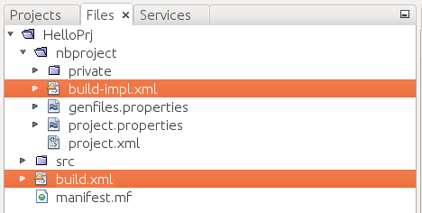

NetBeans 專案中幾個選單常用執行項目，其實都可以對應至 Ant 建構檔案定義的任務：

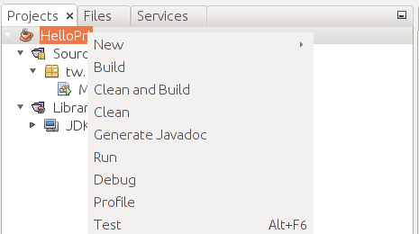

如果你有個 Ant 專案，也可以在 NetBeans 中建立「Java Free Form Project」，在「Build Script」指定你的建構檔案，接著就可以上圖中幾個選項對應的 Ant 任務：

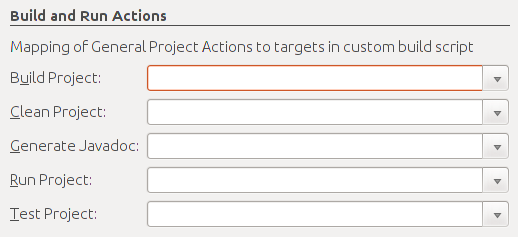

**在 NetBeans 中，目前已整合 Maven**，你可以在新建專案時選擇不同的專案類型：

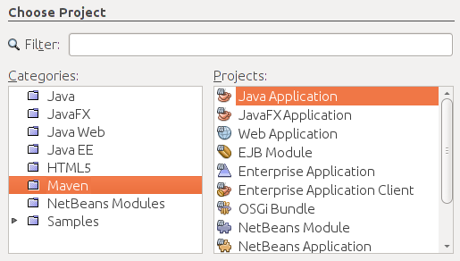

稍後會再來介紹 NetBeans 中如何結合 Gradle …

- Eclipse

Eclipse  最初是由 IBM 公司開發，2001 年 11 月貢獻給開放原始碼社群，目前 Eclipse 的官方網站是 [http://www.eclipse.org/](http://www.eclipse.org/)，Eclipse 幾乎所有其他功能都以 plugin 形式附加於核心之上，因而你會看到各種不同的 Package Solutions。

要運行 Eclipse，基本上你只需要有 Java 執行環境（Java Runtime Environment, JRE），不一定要安裝 JDK，Eclipse 擁有自己的 Java 開發工具（Java Development Tools, JDT），它是 Eclipse 核心的一部份，下載 Eclipse 壓縮檔解開之後，執行 eclipse 指令即可運行。

**Eclipse 內建 Ant 與 Maven 的支援**，你可以自行在專案中建立 build.xml，在選定 build.xml 時的右鍵單下的「Run As」、「Debug As」就會有「Ant Build」項目，你也可以在建立專案時選擇「Java Project from Existing Ant Buildfile」，設定你的「Ant buildfile」：

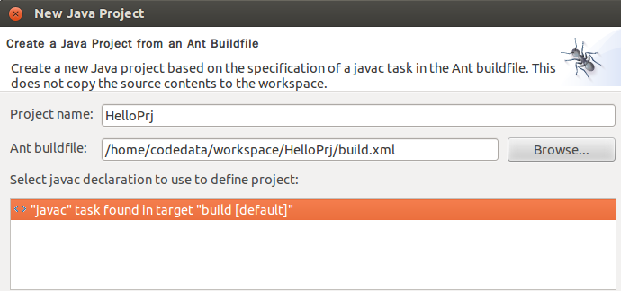

在 IDE 的「Windows/Preferences」功能中，也有個「Ant」項目可以設定 Ant 執行環境等細節：

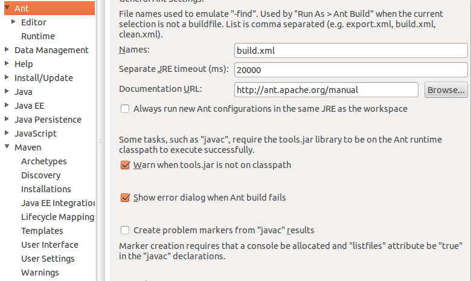

在上面的畫面中，你也看到了 Maven，這表示 Eclipse 中現也支援 Maven，你也可以在新建專案時選擇：

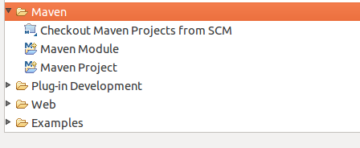

稍後會再來介紹 Eclipse 中如何結合 Gradle …

## Gradle 與 IDE

當然，使用 IDE 最好是對底層工具的基本使用有所概念，才會知道 IDE 的能與不能，也才會知道 IDE 在開發上到底作了哪些協助，而且使用 IDE 會有負擔，如果你就是不想使用 IDE，那麼在使用 Gradle 時，像基本的專案目錄結構，能不能請 Gradle 來協助建立呢？

Gradle 的建構檔案在撰寫時，是使用 Groovy 來設計的 DSL（Domain-Specific Language），**build.gradle 本身就可視為可執行的 Groovy 原始碼檔案**，因此，你可以在任務中撰寫建立目錄的程式碼，例如：

```groovy
apply plugin: 'java'
task "create-dirs" << {
    sourceSets*.java.srcDirs*.each { it.mkdirs() }
    sourceSets*.resources.srcDirs*.each { it.mkdirs() }
}
```

這麼一來，執行 `gradle create-dirs`，就會自動建立 src 目錄及其下各個子目錄。如果想讓你的 Gradle 專案，可以直接在 Eclipse 中進行匯入，可以在 build.gradle 中加上：

```groovy
apply plugin: 'eclipse'
```

然後執行 `gradle eclipse`，這樣就可以自動產生 Eclipse 專案需要的 .settings、.project、.classpath 等檔案，接著你就可以執行 Eclipse 選單的「File -> Import -> General -> Existing Projects into Workspaces」進行匯入：

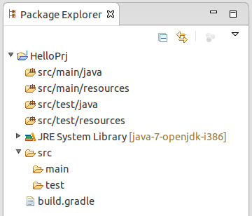

.classpath 是 Eclipse 管理類別路徑的檔案，如果你的 build.gradle 有加入新的相依管理，建議執行 `gradle cleanEclipse` 及 `gradle ecipse`，重新產生 .classpath 的內容，並於 Eclipse 中執行專案的「Refresh」（如果你想自行更新 .classpath，相依檔案預設會存放在使用者目錄的 .gradle 目錄中）。你可以在 [The Eclipse Plugin](http://www.gradle.org/docs/current/userguide/eclipse_plugin.html) 找到更多有關這個 plugin 的說明。

如果你想在 Eclipse 中可以直接管理相依性，或者是執行建構任務，亦可在 Eclipse 中安裝 [eclipse-integration-gradle](https://github.com/spring-projects/eclipse-integration-gradle/)。

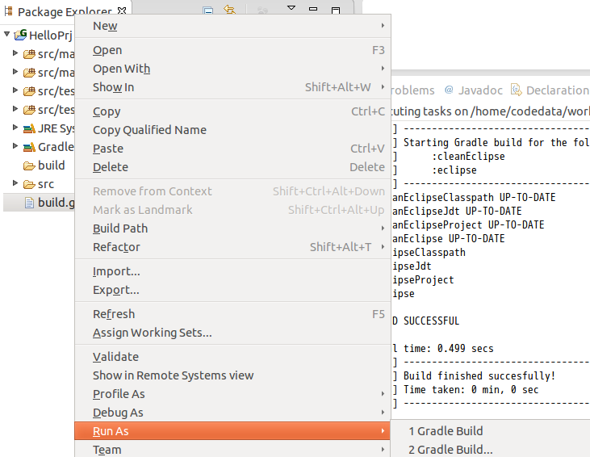

另一個使用 Gradle 直接建立專案目錄的方式，是使用 gradle-templates，相較於自行在 build.gradle 中撰寫 Groovy 以建立目錄，這會是個簡便的方式。

接下來以練習的方式，介紹如何在 NetBeans 中結合 Gradle …

### 練習 8：安裝、使用 NetBeans 與 Gradle Plugins

請至 https://netbeans.org/downloads/ 下載「Java EE」Bundle 的 NetBeans，下載後會是個 netbeans-7.4-javaee-linux.sh 檔案，在終端機中執行以下指令：

    ~$ chmod u+x netbeans-7.4-javaee-linux.sh
    ~$ ./netbeans-7.4-javaee-linux.sh

按照安裝精靈指示完成安裝，完成後啟動桌面的 NetBeans 圖示，執行選單「Tools -> Plugins -> Available Plugins」，在「Search」中輸入「Gradle」，就可進行 Gradle Support 選擇與安裝：

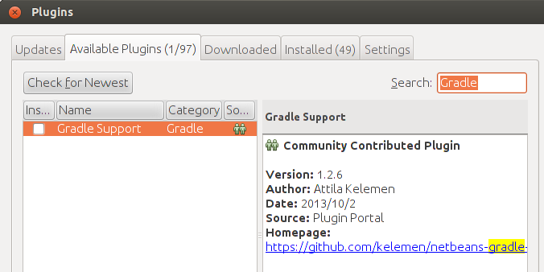

遵照指示完成安裝後，使用 NetBeans 選單「File -> Open Project」開啟 lab 檔案中 solutions/exercise7/Bank 專案，探索並試著執行上頭的 Gradle 相關任務：

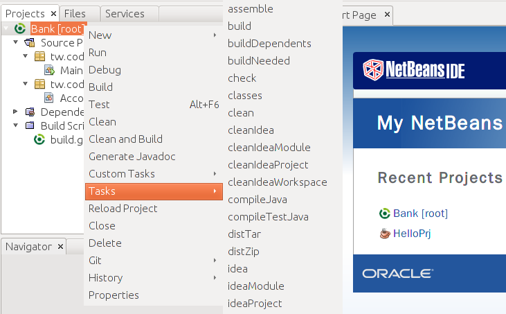

使用 NetBeans 選單「File -> Open Project」開啟 lab 檔案中 exercises/exercise7/Bank 專案，在 IDE 中試著重做一次〈類別〉中的練習 7，看看會不會比較方便一些。

## 關於 JDBC

在商務應用的領域，Java 物件通常表示了商業物件，例如帳戶、表單等，如果商業物件能長久保存，即使 JVM 重新啟動，也能在重新載入時恢復狀態，則稱這種長期保存物件狀態的機制稱為**永續化（Persistence）機制**。當然，你可以使用 Java 的 I/O 相關 API 來進行物件狀態的保留，甚至使用 [Java 物件序列化](http://docs.oracle.com/javase/7/docs/technotes/guides/serialization/) 機制來直接儲存物件，然而，企業最常使用的永續性機制就是關聯式資料庫系統。

Java 早從 1.1 版起，就推出存取資料庫系統的 **JDBC（Java Database Connectivity）**規格，它分為兩個部份：JDBC 應用程式開發者介面（Application Developer Interface）以及 JDBC 驅動程式開發者介面（Driver Developer Interface）。簡而言之，JDBC 將操作資料庫的客戶端 API 與廠商實作分離，Java 開發者只要取得 JDBC 驅動程式，透過標準 API 操作，就可連結各個廠牌資料庫存取資料，不需要因為換資料庫就重新學習新的 API。

一個直接使用 JDBC API 連線資料庫的片段可能會像是這樣：

```java
String url =  "jdbc:mysql://localhost:3306/dvd_library";
String user = "root";
String password = "123456";
Connection conn = null;
SQLException ex = null;
try {
    conn = DriverManager.getConnection(url, user, password);
    ....
}
catch(SQLException e) {
    ex = e;
}
finally {
    if(conn != null) {
        try {
            conn.close();
        }
        catch(SQLException e) {
            if(ex == null) {
                ex = e;
            }
            else {
                ex.addSuppressed(e);
            }
        }
    }
    if(ex != null) {
        throw new RuntimeException(ex);
    }
}
```

這實在是蠻嚇人的！**如果要想確實瞭解 Java 如何存取資料庫，學習 JDBC 確實是必要的**，然而實際上 JDBC 撰寫來冗長且痛苦，就六個小時的課程來說，也沒有閒功夫來做這樣的練習，無論如何，現在有許多程式庫或框架封裝了 JDBC 並提供高階的各種抽象，讓你使用 Java 存取資料庫時，可以有更多簡單而實用的選擇。

## 使用 spring-jdbc

Spring Framework 由 Rod Johnson 在 2002年出版的 J2EE Design and Development 第 13 章中首次公開發表，自 2003 年 1 月起以開放原始碼專案的型式持續發展與改進，Spring 核心包為輕量級元件容器（Lightweight Container），並提供各種 API 封裝及框架整合，學習或使用 Java 的開發者，在 Java 這條路上不免會碰到 Spring，可見 Spring 在 Java 界的重要性。

**就目前來說，如果想使用 Spring 的任何元件，必須透過 Maven 或 Gradle 來取得相依程式庫**。Spring 中提供對 JDBC 的封裝，如果使用 Gradle，可以在 build.gradle 建構檔案中如下定義：

```groovy
apply plugin: 'java'
apply plugin:'application'
mainClassName = 'tw.codedata.Main'
 
repositories {
    mavenCentral()
}
 
dependencies {
    compile 'org.springframework:spring-jdbc:4.0.0.RELEASE'
    compile 'org.hsqldb:hsqldb:2.3.1'
}
```

在這邊也一併加入了 [HSQLDB](http://hsqldb.org/) 的相依性宣告，這是個純 Java 撰寫的資料庫，在這邊使用它，可以不用大費周章地設置資料庫系統，你可以很簡單地透過 HSQLDB 的 `DBCDataSource` 來設置資料庫，以及連線時必要的相關訊息：

```java
JDBCDataSource dataSource = new JDBCDataSource();
dataSource.setUrl("jdbc:hsqldb:file:src/main/resources/db/dvd_library");
dataSource.setUser("codedata");
dataSource.setPassword("123456");
```

`DBCDataSource` 實作了 Java 標準 API 的 `javax.sql.DataSource`，顧名思義，`DataSource` 是個資料來源，可用來取得資料庫連線 `java.sql.Connection` 的實作物件，如果資料庫檔案不存在，在 `setUrl` 時就會建立新的檔案。在 Spring 的 JDBC 的封裝中，最常使用的是 `JdbcTemplate`，其封裝了 JDBC 使用過程中可共用的樣版流程，建構 `JdbcTemplate` 時，需要的正是一個 `DataSource` 實作物件：

```java
JdbcTemplate jdbcTemplate = new JdbcTemplate(dataSource);
```

`JdbcTemplate` 提供了許多存取資料庫的簡便方法，基本上你只需要下 SQL、給定相關的引數，就可以進行資料庫操作，舉例來說，你可以如下使用 `execute` 方法在 HSQLDB 中建立表格：

```java
jdbcTemplate.execute("DROP TABLE dvds if exists");
jdbcTemplate.execute("DROP TABLE directors if exists");
 
jdbcTemplate.execute(
        "CREATE TABLE directors ("
        + "id INTEGER GENERATED BY DEFAULT AS IDENTITY(START WITH 1),"
        + "name VARCHAR(255),"
        + "PRIMARY KEY(id))"
);
jdbcTemplate.execute(
        "CREATE TABLE dvds ("
        + "id INTEGER GENERATED BY DEFAULT AS IDENTITY(START WITH 1),"
        + "title VARCHAR(255),"
        + "year INTEGER NOT NULL,"
        + "duration INTEGER NOT NULL, "
        + "director_id INTEGER NOT NULL, "
        + "FOREIGN KEY (director_id) REFERENCES directors(id))"
);
```

如果想要在資料表格中新增資料，可以使用 `JdbcTemplate` 的 `update` 方法。例如：

```java
jdbcTemplate.update(
        "INSERT INTO directors(name) values(?)", "codedata");
```

如果查詢回來的資料對應於 JVM 中的某個物件，可以使用 `queryForObject` 方法。例如：

```java
jdbcTemplate.queryForObject(
    "SELECT COUNT(*) FROM directors WHERE name=?", 
    new Object[] {"codedata"}, Integer.class);
```

如果查詢結果不只一筆，可使用 `queryForList 方法`，這會傳回一個 `List`，當中每個元素都是 `Map`：

```java
List<Map<String, Object>> results = 
    (List<Map<String, Object>>) jdbcTemplate.queryForList(
        "SELECT * FROM directors WHERE name=?", "codedata");
```

`Map` 中的鍵就是欄位名稱，而值的部份就是欄位值，一個取得所有查詢資料的例子像是：

```java
for(Map<String, Object> result : results) {
    String title = (String) result.get("title");
    Integer age = (Integer) result.get("age");
    ...
}
```

如果想要 `List` 直接是封裝過後的資料物件，可以使用 `RowMapper`，進行簡單的物件封裝。例如：

```java
List<Dvd> dvds = jdbcTemplate.query(
        "SELECT dvds.title, dvds.year, dvds.duration, "
        + "directors.name FROM dvds, directors "
        + "WHERE dvds.director_id = directors.id"
        + " ORDER BY dvds.title",
        new RowMapper<Dvd>() {
            @Override
            public Dvd mapRow(ResultSet rs, int rowNum) throws SQLException {
                return new Dvd(
                       rs.getString("title"),
                        rs.getInt("year"),
                        rs.getInt("duration"),
                        rs.getString("name")
                );
            }
        });
```

這邊列出一些大致的用法，將來你若正式學習過 JDBC，可試著撰寫與這邊功能相似的 JDBC 程式碼，馬上就可以看出使用 `JdbcTemplate` 的好處；實際上，資料永續存取時，會搭配 DAO 模式，如果你需要撰寫 JDBC 實作的 DAO，可以試著繼承 Spring 的 `JdbcDaoSupport`，只要設定給它 `DataSource` 實例，就可以擁有取得 `JdbcTemplate` 等的現成方法。例如：

```java
public class DvdDaoJdbcImpl extends JdbcDaoSupport implements DvdDao {
 
    public DvdDaoJdbcImpl(DataSource dataSource) {
        setDataSource(dataSource);
    }
 
    public DvdDaoJdbcImpl createTables() {
        JdbcTemplate jdbcTemplate = getJdbcTemplate();
        ...
    }
    ...
}
```

### 練習 9：使用 spring-jdbc

在 Lab 檔案的 exercises/exercise9 中有個 SpringJDBC 專案，試著先查看一下其中 `Main`、`Dvd`、`DvdDao`、`DvdDaoJdbcImpl` 等類別的內容與關係。

開啟專案中的 DvdDaoJdbcImpl.java 時，你會發現其中有些程式碼不完整，試著參考以上列出的說明，將程式碼補齊，然後於專案中運行 `gradle run`，查看一下是否可存取、查詢與顯示表格資料。

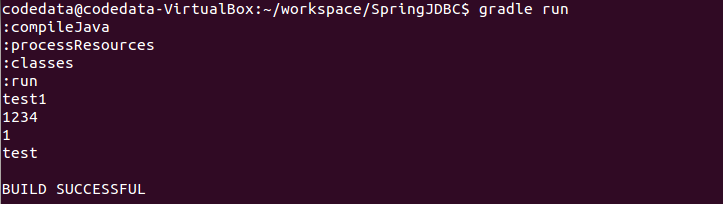

如果有不清楚如何實作的部份，請試著查看 Lab 檔案的 solutions/exercise9 中的 SpringJDBC 專案，當中有實作完成的程式碼。

## 使用 Servlet、JSP 開發 Web 應用程式

在 Java 中開發 Web 應用程式會基於 Servlet、JSP  等標準，Servlet、JSP 必須運行於 **Web 容器（Container）**，Web 容器簡單來說，就是個用 Java 寫的應用程式，**從 Servlet、JSP 的角度來看，就是它們唯一認得的 Web 平台**，也就是說，只要你能提供 Web 容器作為 Servlet、JSP 運行的平台，你的 Web 應用程式理想上就不用理會底層實際的 HTTP 伺服器為何。

基於 Servlet、JSP 標準來開放 Web 應用程式，你必須遵守一些實體資源架構，像是編譯出來的 .class 檔案，必須放置在 Web 應用程式目錄中的 /WEB-INF/classes/ 目錄，JAR 檔案必須放置在 /WEB-INF/lib/ 目錄，可直接被 HTTP 客戶端請求的資源（像是 HTML、JavaScript、JSP等原始碼），則可放置在 /WEB-INF/ 以外的其他目錄。

Web 應用程式必須包裝為 **WAR（Web Archive）**，實際上是 zip 壓縮格式、副檔名為 .war 的檔案，這個 WAR 檔案必須依 Web 容器實作廠商之規定部署（Deploy）至伺服器上。Web 容器如何實作有標準規範，Java 領域最常聽到的實作之一是 [Apache Tomcat](http://tomcat.apache.org/)，也就是本課程要使用的實作。

在這邊並不打算大費周章地直接下載 Tomcat、寫個 Servlet、建立 WAR 檔、進行部署等，而是使用 Gradle，搭配 [gradle-tomcat-plugin](https://github.com/bmuschko/gradle-tomcat-plugin) 來進行示範。例如在一個 BasicWeb 目錄中如下編輯 build.gradle：

```groovy
apply plugin: 'tomcat'
 
buildscript {
    repositories {
        jcenter()
    }
 
    dependencies {
        classpath 'org.gradle.api.plugins:gradle-tomcat-plugin:1.0'
    }
}
 
repositories {
    mavenCentral()
}
 
dependencies {
    providedCompile 'javax.servlet:javax.servlet-api:3.1.0'
    def tomcatVersion = '7.0.11'
    tomcat "org.apache.tomcat.embed:tomcat-embed-core:${tomcatVersion}",
           "org.apache.tomcat.embed:tomcat-embed-logging-juli:${tomcatVersion}"
    tomcat("org.apache.tomcat.embed:tomcat-embed-jasper:${tomcatVersion}") {
        exclude group: 'org.eclipse.jdt.core.compiler', module: 'ecj'
    }
}
```

這邊的設定，部份來自 [gradle-tomcat-plugin](https://github.com/bmuschko/gradle-tomcat-plugin) 中的說明，現階段你不用太細究它們，只要知道這可以用 Gradle 啟動一個內嵌的 Tomcat 容器就可以了。在 `providedCompile` 可以看到，這邊**使用 Servlet 3.x，可使用標註（Annotation）來設定 URL 模式（Pattern）等資訊，如果是先前的 Servlet 規範，你會需要 /WEB-INF/web.xml 來進行對應的資訊設定**。

因為使用 Servlet 3.x，你只要在 src/main/java 中 tw/codedata 套件目錄下，撰寫一個 Servlet 原始碼就可以了：

```java
package tw.codedata;
 
import java.io.*;
import javax.servlet.ServletException;
import javax.servlet.annotation.WebServlet;
import javax.servlet.http.*;
 
@WebServlet(urlPatterns={"/hello.view"})
public class HelloWorld extends HttpServlet {
    @Override
    protected void doGet(HttpServletRequest req, HttpServletResponse resp)
                        throws ServletException, IOException {
        resp.getWriter().println("Hello, World");
    }
}
```

`Servlet` 繼承自 `javax.servlet.http.HttpServlet`，如果你要處理 `GET` 請求，就重新定義 `doGet` 方法，`javax.servlet.http.HttpServletRequest` 與 `javax.servlet.http.HttpServletRequest` 分別代表請求與回應物件，呼叫 `HttpServletRequest` 的 `getWriter` 取得輸出資料用的物件後，呼叫 `println` 方法就可輸出字串回應。

注意 `urlPatterns` 設定為 `"/hello.view"`，這表示資源的 URL 是 `/hello.view`，因此接下來，你只要執行 `gradle tomcatRunWar`，開啟瀏覽器請求 http://localhost:8080/BasicWeb/hello.view，就可以看到以下畫面：

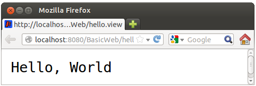

### 練習 10：使用 Servlet、JSP

雖然 Servlet 可以直接輸出呈現內容，不過設計上，Servlet 最好只接受、驗證與轉發請求，不要涉及呈現內容，如果要呈現內容可使用 JSP 技術，要結合 Gradle 與 [gradle-tomcat-plugin](https://github.com/bmuschko/gradle-tomcat-plugin) 的話，JSP 檔案可以放在 src/main/web-app 下（如果你需要 WEB-INF 目錄，也是建在這個目錄下）。

在 Lab 檔案的 exercises/exercise10 中有個 BasicWeb 專案，它是以上示範的成果，請修改一下第一個 Servlet 如下：

```java
package tw.codedata;
 
import java.io.*;
import javax.servlet.ServletException;
import javax.servlet.annotation.WebServlet;
import javax.servlet.http.*;
 
@WebServlet(urlPatterns={"/hello"})
public class HelloWorld extends HttpServlet {
    @Override
    protected void doGet(HttpServletRequest req, HttpServletResponse resp)
                        throws ServletException, IOException {
        String user = req.getParameter("user"); // 取得請求參數
        req.setAttribute("user", user);         // 設定請求屬性
        req.getRequestDispatcher("hello.jsp").forward(req, resp); // 轉發至 JSP
    }
}
```

注意現在的 `urlPatterns` 設定為 `"/hello"` 了，設定請求屬性 `"user"` 為取得的請求參數之後，就可以在 JSP 中使用 `${user}` 來取得並顯示，例如可在 src/main/webapp 目錄中寫個 hello.jsp 如下：

```jsp
<html>
    <body>
        <h1>Hello, ${user}</h1>
    </body>
</html>
```

在執行 `gradle tomcatRunWar` 後，請求 http://localhost:8080/BasicWeb/hello?user=CodeData，就可以看到以下畫面：

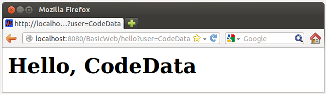

# Java Tutorial 第四堂

Servlet、JSP 是 Java 世界 Web 方案的底層技術，只是要直接用 Servlet、JSP 來建立中大型 Web 應用程式需要比較多的手續，基於快速開發、團隊規範、第三方整合等因素，你可能會選擇使用 Web 框架（Framework），**至於什麼是框架？它跟程式庫（Library）有何不同？**

## 程式庫 vs 框架

從課程一開始，你就一直在使用程式庫，你的程式流程一直在你的控制之內，**你決定**了程式何時要使用程式庫來詢問使用者問題、何時要讀取使用者回應、何時要處理結果 …

當你開始使用框架，你會發現不是你決定程式流程，你會定義函式，由框架決定何時來呼叫你定義的函式。**流程的控制權被反轉了，現在是框架在定義流程，在既定的流程中框架會呼叫你的函式，而不是你來呼叫框架**。

- IoC（Inversion of Control）

在談到框架時，經常會聽到 **IoC** 這個縮寫名稱，也就是 **Inversion of Control**，也就是**控制權反轉，什麼控制權被反轉了？誰能決定程式的流程**！

使用程式庫的話，流程的控制是這樣的 …


藍色部份是你可以自行掌控的部份，你決定程式流程走向，並在過程中必要時機，引用各種程式庫！

使用框架的話，流程的控制是這樣的 …


藍色部份是你可以自行掌控的部份，也就是框架規範下可進行的元件實作，框架在本身定義的流程下適當時機，會呼叫你的元件實作。

- 我們需要使用框架嗎？

應用程式開發時是否需要使用框架，有很多考量點 … 然而簡單來說 … **使用程式庫時，開發者會擁有較高的自由度；使用框架時，開發者會受到較大的限制**。

限制？有哪些限制？很多 … 是否需要使用框架？是否要遵循框架規範的流程？使用框架是基於技術考量？還是基於商業上的考量？（嗯 … 因為這框架是採購案中被綁在一起的 … 上頭叫我們要用我們就得用？）… 這幾個問題都是必須想想看的 …

股市有句名言，好的老師帶你上天堂，不好的老師帶你住套房。用框架時可以這麼想 … **好的框架帶你上天堂，不好的框架讓你下地獄** … XD

## 使用 spring-webmvc

在 Java 的世界中，最不缺少的就是框架，這是 Java 的優點也是缺點，畢竟選擇眾多與太多只是一線之隔。如果你願意，想要使用風格如 Ruby 界的 [Rails](http://rubyonrails.org/)、Python 界的 [Django](https://www.djangoproject.com/) 等的快速開發框架，在 Java 的世界中也有 [Play](http://www.playframework.com/) 這類框架的存在。

在這門課程中，選擇使用 spring-webmvc 框架，這是 [Spring 框架](http://projects.spring.io/spring-framework/) 的一部份，選擇使用它的原因，是它在 Java 界算是知名度與歡迎度都很高的框架，而且第三方程式庫及框架的整合度高，這篇會先練習使用 spring-webmvc 改寫〈使用 Servlet、JSP 開發 Web 應用程式〉中的練習 10，後續會持續再基於 spring-webmvc 整合更多的方案。

### 練習 11：使用 spring-webmvc

在 Lab 檔案的 exercises/exercise11 中有個 SpringMVC 的專案，這其實是練習 10 的成果，只不過目錄名稱改為 SpringMVC 了，請開啟其中的 build.gradle，在 `dependencies { ... }` 中加入 `compile 'org.springframework:spring-webmvc:4.0.0.RELEASE'`：

```groovy
dependencies {
    compile 'org.springframework:spring-webmvc:4.0.0.RELEASE'
    ...
}
```

在 src/main/webapp 中建立 WEB-INF 目錄，接著在 WEB-INF 中建立 web.xml 檔案如下：

```xml
<?xml version="1.0" encoding="UTF-8"?>
<web-app version="3.0" xmlns="http://java.sun.com/xml/ns/javaee"
         xmlns:xsi="http://www.w3.org/2001/XMLSchema-instance"
         xsi:schemaLocation="http://java.sun.com/xml/ns/javaee
         http://java.sun.com/xml/ns/javaee/web-app_3_0.xsd">
    <servlet>
        <servlet-name>dispatcher</servlet-name>
        <servlet-class>org.springframework.web.servlet.DispatcherServlet</servlet-class>
    </servlet>
    <servlet-mapping>
        <servlet-name>dispatcher</servlet-name>
        <url-pattern>/</url-pattern>
    </servlet-mapping>
</web-app>
```

這使用了 spring-webmvc 的 `DispatcherServlet` 接受請求，只要是 URL 以 `/` 結束的請求，都會交由 `DispatcherServlet` 處理，依照這邊的設定，`DispatcherServlet` 預設需要讀取 WEB-INF 中 dispatcher-servlet.xml 設定檔：

```xml
<?xml version="1.0" encoding="UTF-8"?>
<beans xmlns="http://www.springframework.org/schema/beans"
xmlns:mvc="http://www.springframework.org/schema/mvc"
xmlns:xsi="http://www.w3.org/2001/XMLSchema-instance"
xmlns:p="http://www.springframework.org/schema/p"
xmlns:context="http://www.springframework.org/schema/context"
xsi:schemaLocation="http://www.springframework.org/schema/beans http://www.springframework.org/schema/beans/spring-beans-4.0.xsd http://www.springframework.org/schema/mvc http://www.springframework.org/schema/mvc/spring-mvc-4.0.xsd http://www.springframework.org/schema/context http://www.springframework.org/schema/context/spring-context-4.0.xsd">
 
    <context:component-scan base-package="tw.codedata" />
    <mvc:annotation-driven />
 
    <bean class="org.springframework.web.servlet.view.InternalResourceViewResolver"
          p:prefix="/"
          p:suffix=".jsp"/>
</beans>
```

開頭的 XML 宣告有些嚇人，不過基本上只要複製貼上就可以了，`<context:component-scan base-package="tw.codedata" />` 告訴 spring-webmvc，要掃描 `tw.codedata` 套件下，是否有被相關標註（Annotation）設定為元件的類別，這樣的話，你就不用寫一堆 XML 設定檔，對於快速開發會有所助益；`<mvc:annotation-driven />` 則是告訴 spring-webmvc，有關於接受、處理請求的元件，也會使用標註來設定相關訊息。

就這個範例來說，`InternalResourceViewResolver` 的設定不是必要的，如果沒設，處理請求的元件就必須以字串告知 spring-webmvc，接下來由哪個 URL 組織畫面進行回應，也就是你必須傳回如 "hello.jsp" 這樣的字串，這樣會比較沒有彈性，如上設定 `InternalResourceViewResolver` 的話，你只要傳回 "hello" 字串，`InternalResourceViewResolver` 會自動根據 `prefix` 與 `suffix` 設定，得知目前實際上要以 "/hello.jsp" 來進行畫面回應，將來若想要改為其他回應技術，就只需要修改 XML 檔案。

接下來修改 src/main/java/tw/codedata 目錄中的 HelloWorld.java 如下：

```java
package tw.codedata;
 
import org.springframework.stereotype.Controller;
import org.springframework.ui.Model;
import org.springframework.web.bind.annotation.*;
 
@Controller
public class HelloWorld {
    @RequestMapping("hello")
    public String hello(@RequestParam("user") String user, Model m) {
        m.addAttribute("user", user);
        return "hello";
    }
}
```

**spring-webmvc 是個支援 MVC 流程架構的框架**，在 MVC 中，請求是由控制器接受，spring-webmvc 的實作上，可以用 `@Controller` 標示擔任控制器的類別，至於 URL 對應，則使用 `@RequestMapping`，這邊的設定表示 `"/hello"` 的請求會由 `hello` 方法處理。

如果有請求參數，方法上可使用 `@RequestParam` 標註哪個請求參數指定給哪個方法參數，`Model` 參數用來攜帶回應頁面要用到的資料，屬性名稱設定為 `"user"` 時，在 JSP 中可使用 `${user}` 來取得，方法最後傳回 `"hello"`，根據先前 `InternalResourceViewResolver` 的設定，回應的頁面將會是 `"/hello.jsp"`。

完成以上相關設定與程式碼撰寫之後，接著執行 `gradle tomcatRunWar` 指令，開啟瀏覽器請求 http://localhost:8080/SpringMVC/hello?user=CodeData 你應該要能看到以下畫面：

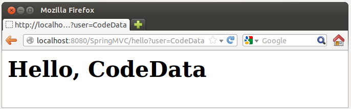

還記得〈使用 spring-jdbc〉中使用過 spring-jdbc 存取資料庫嗎？接下來，將會使用 Spring 的相依注入（Dependency Injection）來進行整合。

## 物件建立與相依注入

在〈使用 spring-jdbc〉中看過，為了能夠使用 `DvdDaoJdbcImpl`，我們必須建立 `DataSource` 實例並進行相關設定：

```java
JDBCDataSource dataSource = new JDBCDataSource();
dataSource.setUrl("jdbc:hsqldb:file:src/main/resources/db/dvd_library");
dataSource.setUser("codedata");
dataSource.setPassword("123456");
```

接著 `DataSource` 實例用來建立 `JdbcTemplate` 實例：

```java
JdbcTemplate jdbcTemplate = new JdbcTemplate(dataSource);
```

然後 `JdbcTemplate` 實例用來建立 `DvdDao` 實例：

```java
DvdDao dvdDao = new DvdDaoJdbcImpl(jdbcTemplate);
```

物件的建立與**相依注入（Dependency Injection）**是我們所關心的，只不過當過程太過冗長，模糊了商務流程之時，應該適當地將之分離，也許建立一個**工廠方法**會比較好：

```java
public class DaoHelper {
    public static DvdDao createDvdDao() {
        JDBCDataSource dataSource = new JDBCDataSource();
        dataSource.setUrl("jdbc:hsqldb:file:src/main/resources/db/dvd_library");
        dataSource.setUser("codedata");
        dataSource.setPassword("123456");
        return new DvdDaoJdbcImpl(new JdbcTemplate(dataSource));
    }
}
```

那麼要取得 `DvdDao` 實例，就只要如下撰寫：

```java
DvdDao dvdDao = DaoHelper.createDvdDao();
```

如此之來，程式碼的流程清晰了，而且即使是不懂 JDBC 或 `JdbcTemplate` 等的開發者，只要透過這樣的方式，也可以直接取得 `DvdDao` 進行操作。

這個 `DaoHelper` 當然是特定用途，隨著你打算開始整合各種程式庫或方案，你會遇到各種物件建立與相依設定需求，為此，你可能會重構 DaoHelper ，使之越來越通用，像是可透過組態檔來進行相依設定，甚至成為一個通用於各式物件建立與相依設定的容器（Container），實際上，這類容器，在 Java 的世界中早已存在，且有多樣性的選擇，你可以調查看看有哪些可以使用，避免直接重新打造輪子。

## 使用 spring 相依注入

先前的課程中已經使用過 Spring 中的一些方案，實際上，Spring 本身的核心就是一個相依注入容器，而且功能強大，事實上，在〈使用 spring-webmvc〉中，就已經使用這個功能了，例如，當你在 dispatcher-servlet.xml 中如下設定時：

```xml
...
    <bean class="org.springframework.web.servlet.view.InternalResourceViewResolver"
          p:prefix="/"
          p:suffix=".jsp"/>
...
```

因為 **spring-webmvc 本身就是基於 Spring 相依注入容器而建立起來的**，就是在告知 Spring 為你建立 `InternalResourceViewResolver` 實例並完成相關設定。

Spring 的相依注入容器，英文上也常簡稱為 **DI（Dependency Injection）**容器 ，實際上，更早前 Spring 採用 IoC（Inversion of Control）容器這個名詞，不過這邊的 IoC 與 Java Tutorial 第四堂（1）使用 spring-webmvc 框架 中談到的 IoC 有所不同，**Spring 的 IoC 指的是物件建立與相依設定的控制權，由開發者手中轉換至容器身上，而 Web 框架之類的 IoC，指的是對流程的控制權，從開發者手中轉換至框架身上**。

簡單來說，Spring 談到的 IoC 容器比較狹義，**為了避免名詞混淆，Spring 建議使用 DI 容器來稱呼其核心容器**。

### 練習 12：使用 Spring 相依注入

這個練習要將練習 10 與練習 11 整合在一起，建立一個簡單的 DVD 管理頁面。在 Lab 檔案的 exercises/exercise12 中有個 DVDLibrary 目錄，已經事先將練習 10 與練習 11 中可重用的程式碼（像是 Dvd.java、DvdDao.java 等）與設定檔（像是 web.xml、dispatcher-servlet.xml 等）準備好。

請開啟 DVDLibrary 目錄中的 build.gradle，在其中的 `dependencies` 中加上 `runtime 'jstl:jstl:1.2'`：

```groovy
dependencies {
    runtime 'jstl:jstl:1.2'
    ...
}
```

這是因為要顯示所有 DVD 清單時，必須得用迴圈之類的語法，不過不建議直接在 JSP 上撰寫 Java 程式碼，JSTL（JavaServer Pages Standard Tag Library）是標準方案，可提供像 HTML 語法的流程標籤，可避免 JSP 頁面中混雜著 Java 程式碼。

接著請開啟 src/main/webapp/WEB-INF 中的 dispatcher-servlet.xml，加入以下設定：

```java
<bean class="org.hsqldb.jdbc.JDBCDataSource"
    p:url="jdbc:hsqldb:file:src/main/resources/db/dvd_library"
    p:user="codedata"
    p:password="123456"/>
```

顯然地，這告訴 Spring 的 DI 容器，要建立 `JDBCDataSource` 實例，並設定使用者、密碼等相關資訊。

在 src/main/java/tw/codedata 目錄中建立 DvdController.java，內容撰寫如下：

```java
package tw.codedata;
 
import org.springframework.beans.factory.annotation.Autowired;
import org.springframework.stereotype.Controller;
import org.springframework.ui.Model;
import org.springframework.web.bind.annotation.*;
 
@Controller
public class DvdController {
    private DvdDao DvdDao;
 
    @Autowired
    public void setDvdDao(DvdDao DvdDao) {
        this.DvdDao = DvdDao;
    }
 
    public DvdDao getDvdDao() {
        return DvdDao;
    }
 
    @RequestMapping("list")
    public String list(Model m) {
        m.addAttribute("dvds", getDvdDao().allDvds());
        return "list";
    }
 
    @RequestMapping("add")
    public String add(
            @RequestParam("title") String title, 
            @RequestParam("year") Integer year,
            @RequestParam("duration") Integer duration,
            @RequestParam("director") String director,
            Model m) {
        Dvd dvd = new Dvd(title, year, duration, director);
        getDvdDao().saveDvd(dvd);
        m.addAttribute("dvd", dvd);
        return "success";
    }
}
```

注意到 `setDvdDao` 方法上有個 `@Autowired` 標註，這告訴 Spring，自動從 DI 容器中找到個型態相符之實例，並透過該方法注入給 `DvdController`，而根據 `@RequestMapping` 設定，請求 `"/list"` 時會由 `list` 方法處理，而請求 `"/add"` 時，會由 `add` 方法處理，兩個方法分別傳回 `"list"` 與 `"success"`，根據 dispatcher-servlet.xml 的設定，這會分別由 list.jsp 與 success.jsp 處理。

請在 src/main/webapp 目錄中，建立一個 success.jsp：

```jsp
<%@page contentType="text/html" pageEncoding="UTF-8"%>
<!DOCTYPE html>
<html>
  <head>
     <meta http-equiv="Content-Type" content="text/html; charset=UTF-8">
     <title>Success</title>
  </head>
  <body>
    You add a DVD.
    <ul>
       <li>Title: ${dvd.title}</li>
       <li>Year: ${dvd.year}</li>
       <li>Duration: ${dvd.duration}</li>
       <li>Director: ${dvd.director}</li>
    </ul>
</body>
</html>
```

這個很簡單，再來建立一個 list.jsp：

```jsp
<%@page contentType="text/html" pageEncoding="UTF-8"%>
<%@taglib prefix="c" uri="http://java.sun.com/jsp/jstl/core"%>
<!DOCTYPE html>
<html>
  <head>
    <meta http-equiv="Content-Type" content="text/html; charset=UTF-8">
    <title>All DVDs</title>
  </head>
  <body>
    <c:forEach var="dvd" items="${dvds}">
      <h1>${dvd.title}</h1>
      <ul>
        <li>Year: ${dvd.year}</li>
        <li>Duration: ${dvd.duration}</li>
        <li>Director: ${dvd.director}</li>
      </ul>
      <hr>
    </c:forEach>
  </body>
</html>
```

`@taglib` 宣告，這個 JSP 頁面會用到標籤庫，前置名稱為 `c`，`uri` 代表著 JSTL 獨一無二的識別，因此之後就可以使用 `<c:forEach>` 來顯示 DVD 清單。

DVDLibrary 中還為你建立了 index.jsp、add.jsp，分別是首頁與表單。執行 `gradle tomcatRunWar` 後，使用瀏覽器連接 http://localhost:8080/DVDLibrary/，就可以進行操作。以下是顯示 DVD 清單的一個頁面示範：

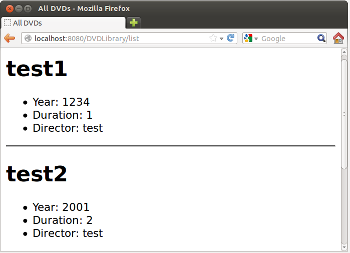

## Hibernate 與 JPA

現在來想想一個需求，如果設計變更，要為每個影片的導演增加更多資訊，因而 `Dvd` 類別中 `String` 的 `director`，必須成為一個 `Director` 型態：

```java
public class Dvd {
    private String title;
    private Integer year;
    private Integer duration;
 
    private Director director;
    ...
}
```

`Director` 中將會包括名稱等資訊：

```java
public class Director {
    private String name;
    ...
}
```

那麼你的 `DvdDaoJdbcImpl` 將得因為這個需求變化而修改程式了。如果隨著後續的程式開發，這類需求不斷增加，可能會導致這類修改不斷發生，而且你會逐漸感受到物件導向與關聯式資料庫因為模型不匹配導致的種種問題，像是物件導向的繼承如何在關聯式資料庫中對應，多型查詢如何實現等問題。

Java 的世界中對這類**物件關聯對應（Object-Relational Mapping, ORM）**當然不缺解決方案，最有名的方案之一就是 [Hibernate](http://hibernate.org/)，2001年末 Hibernate 第一個版本發表，2003 年 6  月 8 日 Hibernate 2 發表，並於年末獲得 Jolt 2004 大獎，由於 Hibernate 廣為流行，設計方式後續影響了 EJB3 中 **JPA（Java Persistence API）** 規格之製定。

使用 Hibernate 這類的 ORM 方案，基本上需要宣告物件與關聯式資料庫的對應關係，後續操作就是從物件的觀點來進行操作，Hibernate 會自動為你產生對應的 SQL 語句。

- hibernate.cfg.xml

對應關係宣告的第一步，就是宣告資料庫組態資訊，這是在 hibernate.cfg.xml 中設定：

```xml
<?xml version="1.0" encoding="UTF-8"?>
<!DOCTYPE hibernate-configuration PUBLIC
"-//Hibernate/Hibernate Configuration DTD 3.0//EN"
"http://hibernate.sourceforge.net/hibernate-configuration-3.0.dtd">
 
<hibernate-configuration>
  <session-factory>
    <property name="hibernate.connection.driver_class">org.hsqldb.jdbc.JDBCDriver</property>
    <property name="hibernate.connection.url">jdbc:hsqldb:file:src/main/resources/db/dvd_library</property>
    <property name="hibernate.connection.username">codedata</property>
    <property name="hibernate.connection.password">123456</property>
    <property name="hibernate.dialect">org.hibernate.dialect.HSQLDialect</property>
    <property name="hibernate.hbm2ddl.auto">create</property>
    <property name="show_sql">true</property>
    <property name="format_sql">true</property>
 
    <mapping class="tw.codedata.Dvd" />
    <mapping class="tw.codedata.Director" />
    </session-factory>
</hibernate-configuration>
```

`hibernate.dialect` 宣告了想使用的資料庫 SQL 方言，`hibernate.hbm2ddl.auto` 設定為 `create`，表示每次都重建資料庫，這在開發測試時有用，讓你不用手動進行這項工作。`show_sql` 表示執行時顯示 Hibernate 自動產生的 SQL 語句，`format_sql` 表示是否將這些產生的 SQL 語句排版一下，以利觀看。

- Entity 宣告

在 hibernate.cfg.xml 中可看到 `mapping` 的 `class` 宣告了 `Dvd` 與 `Director`，這表示物件關係對應資訊，將會在這兩個類別中定義，這樣的類別稱為 Entity 類別。`Dvd` 的宣告如下：

```java
package tw.codedata;
 
import javax.persistence.*;
 
@Entity
@Table(name="dvds")
public class Dvd {
    @Id
    @GeneratedValue(strategy = GenerationType.AUTO)
    private Long id;
    private String title;
    private Integer year;
    private Integer duration;
 
    @ManyToOne(cascade=CascadeType.ALL)
    @JoinColumn(name="director_id")
    private Director director;
    ...
}
```

作為 Entity 的類別，必須使用 `@Entity` 標註，如果類別名稱與表格名稱不同，可以使用 `@Table` 標註表格名稱資訊，每個 Entity 類別必須有獨一無二的識別屬性，並與資料表格的主鍵相對應，使用 `@Id` 標註，在這邊還標註了 `@GeneratedValue(strategy = GenerationType.AUTO)`，表示利用資料庫本身的主鍵自動產生策略。

一個導演可能主導多個影片，因此 `Dvd` 與 `Director` 的關係是多對一，這使用 `@ManyToOne` 標註，`cascade=CascadeType.ALL` 表示聯級操作，設定為無論儲存、合併、 更新或移除，一併對被參考物件作出對應動作。`@JoinColumn(name="director_id")` 設定了資料庫外鍵的欄位名稱為 `director_id`。

類似地，`Director` 也必須進行相關標註：

```java
package tw.codedata;
 
import javax.persistence.*;
 
@Entity
@Table(name="directors")
public class Director {
    @Id
    @GeneratedValue(strategy = GenerationType.AUTO)
    private Long id;
    private String name;
    ...
}
```

那麼那些沒有標註的欄位呢？沒有標註就會採預設值，例如 `Director` 的 `name` 欄位沒有標註，那就是對應至 `directors` 表格的 `name` 欄位，如果欄位名稱不同，可以使用 `@Column` 標註。

注意到 `import` 時是 `javax.persistence`，如前所述，Hibernate 影響了 JPA 的規格制定，原本 Hibernate 的相關標註是置放於 `org.hibernate.annotations` 之中，`javax.persistence` 有許多標註與之對應，由於 JPA 已是標準，標註時鼓勵你使用 `javax.persistence` 中的相關標註，實際上你使用最新版的 Hibernate，若使用了 `org.hibernate.annotations` 中的標註，就會發現它們已不再建議使用（Deprecated）。

- `SessionFactory`

你可以使用 `Configuration` 讀取 hibernate.cfg.xml、建立 `SessionFactory` 物件，後者用來建立 `Session` 物件，負責資料庫操作過程的功能。不過這個過程，老實說，很麻煩，因此建立一個 `HibernateUtil` 類別會比較方便一些：

```java
package tw.codedata;
 
import org.hibernate.cfg.Configuration;
import org.hibernate.SessionFactory;
import org.hibernate.boot.registry.StandardServiceRegistry;
import org.hibernate.boot.registry.StandardServiceRegistryBuilder;
 
public class HibernateUtil {
 
    private static final SessionFactory sessionFactory;
    private static final StandardServiceRegistry serviceRegistry;
 
    static {
        try {
            Configuration configuration = new Configuration();
            configuration.configure();
 
            serviceRegistry = new StandardServiceRegistryBuilder()
                               .applySettings(configuration.getProperties()).build();
            sessionFactory = configuration.buildSessionFactory(serviceRegistry);
        } catch (Throwable ex) {
            throw new ExceptionInInitializerError(ex);
        }
    }
 
    public static SessionFactory getSessionFactory() {
        return sessionFactory;
    }
 
    public static void closeAllResources() {
        sessionFactory.close();
        StandardServiceRegistryBuilder.destroy(serviceRegistry);
    }
}
```

老實說，這個過程是蠻醜陋的，因而，在你將來有時間深入 Hibernate 之前，故且當這是個魔法好了 …

- 儲存與查詢

有了 `SessionFactory` 實例之後，你就可以來個簡單的儲存過程了：

```java
Session session = sessionFactory.openSession();
session.beginTransaction(); // 開啟交易
session.save(dvd); // 儲存 Dvd 實體
session.getTransaction().commit(); // 確認變更
session.close(); // 關閉此次操作過程
```

查詢的話，有幾種方式，像是搭配 HQL（Hibernate Query Language）：

```java
Session session = sessionFactory.openSession();
session.beginTransaction();
List dvds = session.createQuery("from Dvd").list();
 
session.getTransaction().commit();
session.close();
```

注意！`"from Dvd"` 不是 SQL，而是 HQL，讀起來是「從 `Dvd` 實體物件中查詢」，而不是「從 Dvd 表格中查詢」，記得嗎？`Dvd` 中有個 `Director`，Hibernate 會自動查詢並封裝為 `Director` 實例。

### 練習 13：使用 Hibernate

在 Lab 檔案的 exercises/exercise13 中有個 Hibernate 目錄，這是改寫自〈使用 spring-jdbc〉的範例，其中 build.gradle 已經幫你寫好了：

```groovy
apply plugin: 'java'
apply plugin:'application'
mainClassName = 'tw.codedata.Main'
 
repositories {
    mavenCentral()
}
 
dependencies {
    compile 'org.hsqldb:hsqldb:2.3.1'
    compile group: 'com.google.guava', name: 'guava', version: '15.0'
    compile 'org.hibernate:hibernate-core:4.3.0.Final'
}
```

hibernate.cfg.xml、`Dvd`、`Director` 的標註、`HibernateUtil` 基本上就是上頭描述過的，也都已經先為你撰寫好了。那你要做什麼？觀察剛描述過的幾個檔案之位置與內容，然後建一個 `DirectorDaoHibernateImpl` 內容如下：

```java
package tw.codedata;
 
import com.google.common.base.Optional;
import java.util.List;
import org.hibernate.*;
 
public class DirectorDaoHibernateImpl implements DirectorDao {
    private SessionFactory sessionFactory;
 
    public DirectorDaoHibernateImpl(SessionFactory sessionFactory) {
        this.sessionFactory = sessionFactory;
    }
 
    @Override
    public void saveDirector(Director director) {
        Session session = sessionFactory.openSession();
        session.beginTransaction();
        session.save(director);
        session.getTransaction().commit();
        session.close();
    }
 
    @Override
    public Optional maybeFromName(String name) {
        Session session = sessionFactory.openSession();
        session.beginTransaction();
 
        List directors = 
                          session
                          .createQuery("from Director as d where d.name = :name")
                          .setString("name", name).list();
 
        session.getTransaction().commit();
        session.close();
 
        return directors.isEmpty() ? Optional.absent() :  Optional.of(directors.get(0));
 
    }
}
```

這個 DAO 負責 `Director` 的儲存與查詢，接著建一個 `DvdDaoHibernateImpl` 如下：

```java
package tw.codedata;
 
import java.util.List;
import org.hibernate.Session;
import org.hibernate.SessionFactory;
 
public class DvdDaoHibernateImpl implements DvdDao {
    private SessionFactory sessionFactory;
 
    public DvdDaoHibernateImpl(SessionFactory sessionFactory) {
        this.sessionFactory = sessionFactory;
    }
 
    @Override
    public void saveDvd(Dvd dvd) {
        Session session = sessionFactory.openSession();
        session.beginTransaction();
        session.save(dvd);
        session.getTransaction().commit();
        session.close();
    }
 
    @Override
    public List allDvds() {
        Session session = sessionFactory.openSession();
        session.beginTransaction();
 
         List dvds = session.createQuery("from Dvd").list();
 
        session.getTransaction().commit();
        session.close();
 
        return dvds;
    }
}
```

觀察一下 `Main` 的內容：

```java
package tw.codedata;
 
import org.hibernate.*;
 
public class Main {
    public static void main(String[] args) {
 
        SessionFactory factory = HibernateUtil.getSessionFactory();
 
        DirectorDao directorDao = new DirectorDaoHibernateImpl(factory);
        DvdDao dvdDao = new DvdDaoHibernateImpl(factory);
 
        Director director = new Director("XD");
        directorDao.saveDirector(director);
 
        dvdDao.saveDvd(new Dvd("XD", 112, 1, director));
 
        for(Dvd dvd : dvdDao.allDvds()) {
           System.out.println(dvd);
        }
 
        HibernateUtil.closeAllResources();       
    }
}
```

接著執行 `gradle run`，觀察一下，你會看到什麼輸出結果。在這個練習中，你有感覺到哪邊不太方便嗎？這些不便之處，接下來會使用 spring-orm 來改善 …

# Java Tutorial 第五堂

在先前的課程中，我們〈使用 spring-webmvc 框架〉建立簡單的 Web 應用程式，〈使用 spring 相依注入〉中進行依賴物件之注入，而在〈Hibernate 與 JPA〉 中 … 

## 使用 spring-orm

既然認識了 ORM，那麼就也來使用 spring-orm 將之整合起來至〈使用 spring 相依注入〉撰寫的 DVDLibrary 專案之中吧！

### 練習 14：使用 spring-orm

這個練習要將練習 12 與練習 13 整合在一起。在 Lab 檔案的 exercises/exercise14 中有個 DVDLibrary 目錄，已經事先將練習 12 與練習 13 中一些可重用的程式碼（像是 Dvd.java、DvdDao.java 等）與設定檔（像是 build.gradle 等）準備好。

spring-orm 提到了 `LocalSessionFactoryBean`，用以簡化 Hibernate 的 `SessionFactoy` 之設定與建立，請開啟 dispatcher-servlet.xml，在 `JDBCDataSource` 的 `bean` 設定上增加 `id` 屬性為 `dataSource`，同時也增加 `LocalSessionFactoryBean` 之設定：

```xml
...
 <bean id="dataSource" class="org.hsqldb.jdbc.JDBCDataSource"
         p:url="jdbc:hsqldb:file:src/main/resources/db/dvd_library"
         p:user="codedata"
         p:password="123456"/>
 
 <bean class="org.springframework.orm.hibernate4.LocalSessionFactoryBean">
     <property name="dataSource" ref="dataSource" />
     <property name="packagesToScan" value="tw.codedata" />
     <property name="hibernateProperties">
         <props>
             <prop key="hibernate.hbm2ddl.auto">create</prop>
             <prop key="hibernate.dialect">org.hibernate.dialect.HSQLDialect</prop>
             <prop key="show_sql">true</prop>
             <prop key="format_sql">true</prop>
         </props>
     </property>
 </bean>
...
```

在這邊，透過 `LocalSessionFactoryBean` 的 `setDataSource` 注入 `DataSource` 實例，`packageToScan` 設定了自動掃描實體（Entity）物件的套件來源，這樣就會自動尋找設定了 `@Entity` 的類別取得 ORM 資訊。

練習 13 中的 `Dvd`、`Director`、`DvdDao`、`Director` 以及對應的 DAO 實作類別，都已經複製至練習 14 準備的專案之中，在動手修改 `DvdController` 之前，請先看一下原本的程式碼，例如 `add` 方法原先是這麼撰寫的：

```java
...
Dvd dvd = new Dvd(title, year, duration, director);
getDvdDao().saveDvd(dvd);
m.addAttribute("dvd", dvd);
    ...
```

接下來你可能會打算將之改為：

```java
...
DirectorDao directorDao = new DirectorDaoHibernateImpl(factory);
DvdDao dvdDao = new DvdDaoHibernateImpl(factory);
 
Director director = new Director("XD");
directorDao.saveDirector(director);
 
dvdDao.saveDvd(new Dvd("XD", 112, 1, director));
...
```

在 MVC 架構中，控制器應該是擔任請求轉發，而上頭的流程似乎混入了商務邏輯，也就是包括了 `Director`、`Dvd` 物件之建立、設定相依關係，以及分別利用 `DirectorDao`、`DvdDao` 分別儲存的邏輯，這並不建議，如果日後這些邏輯有了更複雜的變化，控制器就會開始面臨不斷的修改而增胖；另一方面，上面這種寫法，會讓控制器依賴在 `DvdDao`、`DirectorDao` 等多個介面之上。

因此，建議建立一個新的商務物件來處理相關流程，例如若有個 `DvdLibraryService` 提供了 `addDvd` 與 `allDvds` 方法，就可以將 `DvdController `如下修改：

```java
package tw.codedata;
 
import org.springframework.beans.factory.annotation.Autowired;
import org.springframework.stereotype.Controller;
import org.springframework.ui.Model;
import org.springframework.web.bind.annotation.*;
 
@Controller
public class DvdController {
    private DvdLibraryService dvdLibraryService;
 
    @Autowired
    public void setDvdLibraryService(DvdLibraryService dvdLibraryService) {
        this.dvdLibraryService = dvdLibraryService;
    }
 
    public DvdLibraryService getDvdLibraryService() {
        return dvdLibraryService;
    }
 
    @RequestMapping("list")
    public String list(Model m) {
        m.addAttribute("dvds", getDvdLibraryService().allDvds());
        return "list";
    }
 
    @RequestMapping("add")
    public String add(
            @RequestParam("title") String title, 
            @RequestParam("year") Integer year,
            @RequestParam("duration") Integer duration,
            @RequestParam("director") String director,
            Model m) {
        Dvd dvd = getDvdLibraryService().addDvd(title, year, duration, director);
        m.addAttribute("dvd", dvd);
        return "success";
    }
}
```

以上也利用了 Spring 自動注入 `DvdLibraryService`，如下修改之後，`DvdController` 仍維持基本的請求轉發職責，也僅依賴在 `DvdLibraryService` 之上，而 `DvdLibraryService` 只是包括了原先打算寫在 `DvdController` 的邏輯：

```java
package tw.codedata;
 
import java.util.List;
import org.springframework.beans.factory.annotation.Autowired;
import org.springframework.stereotype.Service;
 
@Service
public class DvdLibraryService {
    private DirectorDao directorDao;
    private DvdDao dvdDao;
 
    @Autowired
    public void setDirectorDao(DirectorDao directorDao) {
        this.directorDao = directorDao;
    }
 
    @Autowired
    public void setDvdDao(DvdDao dvdDao) {
        this.dvdDao = dvdDao;
    }
 
    public DirectorDao getDirectorDao() {
        return directorDao;
    }
 
    public DvdDao getDvdDao() {
        return dvdDao;
    }
 
    public List<Dvd> allDvds() {
        return getDvdDao().allDvds();
    }
 
    public Dvd addDvd(String title, Integer year, Integer duration, String directorName) {
 
        Director director = new Director(directorName);
        getDirectorDao().saveDirector(director);
        Dvd dvd = new Dvd(title, year, duration, director);
        getDvdDao().saveDvd(dvd);
        return dvd;
    }
}
```

為了讓 Spring 可以自動在 `DvdLibraryService` 中注入 `DirectorDao` 與 `DvdDao` 實例，你要在 `DirectorDaoHibernateImpl` 與 `DvdDaoHibernateImpl` 中加註 `@Service`：

```java
package tw.codedata;
 
import com.google.common.base.Optional;
import java.util.List;
import org.hibernate.*;
import org.springframework.beans.factory.annotation.Autowired;
import org.springframework.stereotype.Service;
 
@Service
public class DirectorDaoHibernateImpl implements DirectorDao {
    private SessionFactory sessionFactory;
 
    @Autowired
    public DirectorDaoHibernateImpl(SessionFactory sessionFactory) {
        this.sessionFactory = sessionFactory;
    }
 
    ...
```

其中 `SessionFactory` 的建構，也是透過 `@Autowired` 標註，讓 Spring 自動將 dispatcher-servlet.xml 中設定的 `LocalSessionFactoryBean` 注入。`DvdDaoHibernateImpl` 也是增加相同的標註：

```java
package tw.codedata;
 
import java.util.List;
import org.hibernate.Session;
import org.hibernate.SessionFactory;
import org.springframework.beans.factory.annotation.Autowired;
import org.springframework.stereotype.Service;
 
@Service
public class DvdDaoHibernateImpl implements DvdDao {
    private SessionFactory sessionFactory;
 
    @Autowired
    public DvdDaoHibernateImpl(SessionFactory sessionFactory) {
        this.sessionFactory = sessionFactory;
    }
 
...
```

接下來就可以使用 `gradle tomcatRunWar` 來啟動程式，如果啟動時發生了 OutOfMemoryError: PermGen space 的錯誤，這是因為 JVM 的記憶體配置中，用來存放 .class 資訊的 PermGen 記憶體區段空間不足，可以在專案根目錄中建立一個 gradle.properties，撰寫以下資訊，增加 JVM 的 PermGen 區段空間大小：

    org.gradle.jvmargs=-XX:MaxPermSize=256m

## JUnit 與 Gradle

在先前一連串的練習中，我們作了數次的重構（Refactoring），每次重構時是不是會有些怕怕的，如果不小心改爛了怎麼辦？每次重構完總得執行整個應用程式，看看功能是不是正確？只不過，對這種測試方式終究有些不安，對吧！？

你應該為撰寫的程式加入一些專門用的測試程式，在測試中最基本的單位是單元測試（Unit test），指的是測試一個工作單元（a unit of work）的行為。舉例來說，對於建築橋墩而言，一個螺絲釘、一根鋼筋、一條鋼索甚至一公斤的水泥等，都可謂是一個工作單元，驗證這些工作單元行為或功能 （硬度、張力等）是否符合預期，方可確保最後橋墩安全無虞。

在 Java 的世界談到單元測試，基本上都得認識一下 [JUnit](http://junit.org/) 這個元老級的單元測試框架，IDE 多半都有整合這個框架。在這邊先介紹一下如何在 Gradle 中結合 JUnit 作一個簡單的測試。

### 練習 15：在 Gradle 中使用 JUnit

首先，你必須在 build.gradle 中增加 `'java'` 這個 plugin，它內建了 test 的任務定義：

```groovy
apply plugin: 'java'
```

我們要使用 JUnit 4 來撰寫單元測試，因此要在 `dependencies` 中定義 `testCompile`：

```groovy
dependencies {
    testCompile 'junit:junit:4.+'
    略 ...
}
```

從之前的練習中已經知道，Gradle 中 Java 程式碼，必須定義在 src/main/java 之中，並依套件設定在對應的目錄放置 .java 程式碼，這邊先撰寫一個簡單的 `Hello` 類別：

```java
package tw.codedata;
    
public class Hello {
    public String sayHelloTo(String name) {
        return String.format("Hello, %s!", name);
    }
}
```

如果你傳給 `Hello` 實例的 `sayHelloTo` 方法一個字串，例如 `"CodeData"`，那麼它會傳回一個字串 `"Hello, CodeData!"`，你要怎麼確定這個方法是正確的呢？直接撰寫個測試程式輸出字串顯示在文字模式下，看是不是會顯示 Hello, CodeData! 嗎？如果有 1000 個測試，難不成要看 1000 個顯示結果來確定測試是否正確？

不是的！使用 JUnit 的話，可以自動運行測試並收集測試結果，你可以如下定義一個測試案例（Test case）：

```java
package tw.codedata;
 
import static org.junit.Assert.*;
import org.junit.*;
 
public class HelloTest {
    @Test
    public void sayHelloTo() {
        Hello hello = new Hello();
        assertEquals("Hello, CodeData!", hello.sayHelloTo("CodeData"));
    }
}
```

對於一個 `Hello` 類別，你可以定義一個 `HelloTest` 來與之對應，你可以在某個方法中定義想要的測試過程，該方法要使用 `@Test` 標註，`assertEquals` 是個斷言方法，第一個參數接受預期值的指定，第二個參數接受實際執行結果，如果兩者相等則斷言成功，否則就測試失敗。

那麼 HelloTest.java 要放在哪呢？必須放在 src/test/java 中，並依套件設定在對應的目錄放置 .java 程式碼。

目前原始碼的位置對應是：

- src/main/java/tw/codedata/Hello.java 
- src/test/java/tw/codedata/HelloTest.java

接著要運行測試，可以執行 `gradle test` 指令，如果測試成功的話，會顯示以下的畫面：


在 build/reports/tests 中，也會產生一份 HTML 報表：


要是測試失敗的話，會有類似以下的畫面：


測試失敗時報表的呈現方式是 …


## 測試與重構

在瞭解如何使用 JUnit 之後，接著來試著重新做一次〈使用 spring-orm〉中的練習，由於時間有限，我們僅將重點放在 `DvdController` 的測試與重構。

### 練習 16：為 DvdController 建立測試

在 Lab 檔案的 exercises/exercise16 中有個 DVDLibrary 目錄，已經事先將練習 14 與練習 15 中一些可重用的程式碼（像是 Dvd.java、DvdDao.java、DvdLibraryService.java 等）與設定檔（像是 build.gradle 等）準備好，不過，`DvdController` 仍是使用 `DvdDao` 程式碼，在將程式重構為運用 `DvdLibraryService` 之前，先來為它寫個測試。

請在 src/test/java/tw/codedata 中建立一個 DvdController.java，如下撰寫程式碼：

```java
package tw.codedata;
 
import static org.junit.Assert.*;
import org.junit.*;
import java.util.*;
import org.springframework.ui.Model;
 
public class DvdControllerTest {
    List<Dvd> dvds;
    Map attributesOfModel;
    DvdController controller;
    Model model;
 
    @Before
    public void setUp() {
        dvds =  new ArrayList<>(Arrays.asList(
           new Dvd("dvd1", 1, 2, new Director("director1"))));
 
        attributesOfModel = new HashMap();
 
        controller = new DvdController();
        controller.setDvdDao(new DvdDao() {
            public void saveDvd(Dvd dvd) {
                dvds.add(dvd);
            }
            public List<Dvd> allDvds() {
                return dvds;
            }
        });
 
        model = new Model() {
            @Override
            public Model addAttribute(String attributeName, Object attributeValue) {
                attributesOfModel.put(attributeName, attributeValue);
                return this;
            }
 
            @Override
            public Model addAttribute(Object attributeValue) {
                throw new UnsupportedOperationException("Not supported yet."); 
            }
 
            其他方法實作，可如上撰寫就好，因為用不到 ...
 
        };
    }
 
    @Test
    public void testList() {
        String result = controller.list(model);
        assertEquals("list", result);
        assertEquals(dvds, attributesOfModel.get("dvds"));
    }
 
    @Test
    public void testAdd() {
        String result = controller.add("dvd1", 1, 2, "director1", model);
        Dvd dvd = (Dvd) attributesOfModel.get("dvd");
 
        assertEquals("success", result);
        assertEquals(2, dvds.size());
        assertEquals("dvd1", dvd.getTitle());
    }
}
```

在這邊看到 `@Before`，在每個 `@Test` 方法被執行之前，都會先執行一次 `@Before` 方法，因此可以在被標註的方法中，準備好測試之前必須要有的素材（Fixture）。

`testList` 方法中要測試 `DvdController` 的 `list` 方法，我們需要傳入一個 `Model`，因此在 `@Before` 方法中，實作了 `Model` 介面，我們需要確定 `list` 方法會傳回 `"list"`，並且會在 `Model` 中設置 `"dvds"` 屬性，設定的物件是 DVD 的清單物件。

注意，無論是 `Model` 或是 `DvdDao`，都不是實際上運行時，真正相依的實作物件，而是我們自行撰寫的簡單物件，因為這是在進行單元測試，因此，以我們實作的簡單物件來與其他單元作了隔離，這個簡單物件，只要能夠在設定的條件下回應被測試對象就可以了。

舉例來說，我們用了 `ArrayList` 來做為假裝的資料庫，用 `HashMap` 來做為屬性設定的儲存對象。在 `testList` 與 `testAdd` 中，除了斷言 `DvdController` 的方法是否傳回預期的值之外，也用這兩個簡單的 `ArrayList` 與 `HashMap` 來斷言副作用輸出是否符合預期。

完成以上程式之後，執行 `gradle test` 指令，你應該可以看到 "BUILD SUCCESSFUL" 測試成功的結果。

### 練習 17：重構與測試 DvdController

接下來，可以重構 `DvdController` 了，不過在實際修改 `DvdController` 之前，可以先來修改一下 `DvdControllerTest`，因為基本上就公開操作介面來說，我們將相依於 `DvdDao` 改為相依於 `DvdLibraryService`，而對 `list` 及 `add` 方法的預期並沒有改變，所以 `DvdControllerTest` 的修改，應該只涉及測試素材修改的部份 ...

```java
package tw.codedata;
 
import static org.junit.Assert.*;
import org.junit.*;
import java.util.*;
import org.springframework.ui.Model;
 
public class DvdControllerTest {
    List<Dvd> dvds;
    Map attributesOfModel;
    DvdController controller;
    Model model;
 
    @Before
    public void setUp() {
        ...同前...
 
        controller = new DvdController();
        controller.setDvdLibraryService(new DvdLibraryService() {
            @Override
            public List<Dvd> allDvds() {
                return dvds;
            }
 
            @Override
            public Dvd addDvd(String title, Integer year, Integer duration, String directorName) {
                Dvd dvd = new Dvd(title, year, duration, new Director(directorName));
                dvds.add(dvd);
                return dvd;
            }
        });
 
        ...同前...
    }
 
    ...同前...
}
```

因為是對 `DvdController` 做單元測試，不必要用真正的 `DvdLibraryService`，因而使用了匿名類別繼承 `DvdLibraryService`，重新實作了 `allDvds` 與 `addDvd` 方法，只要讓這兩個方法能回應 `DvdController` 的呼叫，並能夠讓我們斷言副作用是否符合預期即可。

完成以上程式之後，執行 `gradle test` 指令，你應該可以看到測試失敗，因為 `DvdController` 還沒修改，所以現在的 `DvdControllerTest` 根本無法編譯：


在修改（或撰寫）程式之前，先撰寫測試，這是測試驅動（Test-driven）的概念，這樣，你就能先思考你想要的程式介面或規格。

接下來，你可以如〈使用 spring-orm〉中的練習 14 修改 `DvdController`，然後重新執行 `gradle test` 指令，這次你應該要能夠看到 "BUILD SUCCESSFUL" 測試成功的結果。

# Java Tutorial 第六堂

先前一直在談 Java 的 Web 應用程式，接下來在最後一堂課中，我們來談談 Java 在 Web 世界中，對 Web Services 的支援方式之一，也就是 Java EE 6 時納入的 JAX-RS（Java API for RESTful Web Services），剩下的時間不夠，因此設定一個簡單的目標，認識 REST，使用 JAX-RS 的參考實作（Reference Implementation, RI）之一 [Jersey](http://jersey.java.net/)，並在 DVDLibrary 中使用 Jersey MVC。 

## 簡介 REST

JAX-RS 的 R 代表 **RESTful** 縮寫，因此你要先瞭解 **REST**，REST 是一種軟體架構風格，全名是 **REpresentational State Transfer**，可譯為表徵狀態轉移，為 [Roy Fielding](http://en.wikipedia.org/wiki/Roy_Fielding) 於2000年在他的論文 [Architectural Styles and the Design of Network-based Software Architectures](http://www.ics.uci.edu/~fielding/pubs/dissertation/top.htm) 中提及。 

REST 的架構由客戶端（Client）/伺服端（Server）組成，客戶端與伺服端之間的通訊機制是無狀態的（Stateless），客戶端對伺服端請求資源（Resource），伺服端的回應為資源的表徵（Representation），或稱為表現方式，也就是說，資源在 REST 中是可定址的（Addressed）概念，可能用檔案、文件、格式等來表現，代表資源目前或可能的狀態（State）。客戶端發出的請求，會獲得資源的最新狀態，如果一或多個請求獲取的狀態有了差異，客戶端就認定為發生了轉移（Transition），客戶端獲取的表徵，可能包括發生下一次狀態轉移的連結，請求方法與回應方式，是根據資源的表徵狀態將如何轉移（Transfer）而決定。

在 REST 的架構中，資源是可定址的（Addressed）概念，會有獨一無二的識別名稱（例如 Web 中的 URI 名稱），請求動作必須能表現出如何處理請求（例如 HTTP 中的 GET、POST、PUT、DELETE 等請求），而回應的內容型態與資源的概念是分離的，一個資源可以有多種內容型態來展現（狀態）。

在設計 REST 風格的架構時，許多人會提到 REST Triangle，例如  [Talk:Representational state transfer](http://en.wikipedia.org/wiki/Talk:Representational_state_transfer) 中的這張圖：


在 REST Triangle 中有名詞（Nouns）、動詞（Verbs）與內容型態（Content Types），分別用以代表資源獨一無二的識別、對資源進行操作的動作，以及資源的表徵（表現方式）。

以 HTTP 來說，URI 就是處於名詞角色，為資源定義了識別名稱，HTTP 具有一組有限的 GET、POST、PUT 與 DELETE 等方法來操作資源，而 HTTP 可以使用 content-type 標頭來定義資源表現方式。這些概念與 REST 概念不謀而合，REST 架構基於 HTTP 1.0，與 HTTP1.1 平行發展，符合 REST 最大實現就是 WWW，整個 Web 就像是個狀態機，藉由連結不斷改變狀態，不過 REST 架構的風格與特定協定無關，雖然最初是使用 HTTP 來描述，但不限於 HTTP。

更多 REST 的概念，可以參考 [Representational state transfer](http://en.wikipedia.org/wiki/REST)。來看看 HTTP 如何實現 REST 概念，以基本 CRUD 來說，針對 DVD 記錄而言，設計的範例之一可以是：

- GET /dvds/
- GET /dvds/1
- GET /dvds/add
- POST /dvds/
- PUT /dvds/1
- DELETE /dvds/1


這幾個 HTTP 方法與 URI 結合的意義分別是：

- 取得 DVD 清單（從 /dvds/ 資源取得表徵）
- 取得第一筆 DVD 記錄（從 /dvds/1 資源取得表徵）
- 取得新增 DVD 的頁面（從 /dvds/add 資源取得表徵）
- 發送一筆 DVD（將資料發送至 /dvds/ 作新增處理）
- 推送一筆 DVD（將資料發送至 /dvds/ 作新增或更新處理）
- 刪除一筆 DVD（刪除 /dvds/1 資源） 

每個 URI 代表一個可處理請求的資源，根據請求為 GET、PUT 或 POST，就可以知道對該資源要作什麼樣的處理（符合 REST 中請求動作必須能表現出本身如何處理的概念）。以上說明的是 REST 的基本實現概念。符合 REST 風格的實現稱為 RESTful。

## 使用 JAX-RS

Java EE 6 起包含了對 RESful Web Service 的解決方案 JAX-RS，其架構於 Servlet 標準之上，JAX-RS 是個技術標準，各家廠商可以有自己的實作，在接下來的範例中，我們會使用 Jersey 是實作之一，關於 JAX-RS 與 Jersey 詳細的說明，可以參考〈[Java 與 REST 的邂逅](http://www.codedata.com.tw/java/java-restful-1-jersey-and-jax-rs)〉系列，接下來我們直接從範例中瞭解如何使用 Jersey 來寫個簡單的 JAX-RS 範例。

### 練習 18：使用 JAX-RS

建立一個 JerseyExample 專案目錄，並在其中新增一個 build.gradle 如下：

```groovy
apply plugin: 'tomcat'
 
buildscript {
    repositories {
        jcenter()
    }
 
    dependencies {
        classpath 'org.gradle.api.plugins:gradle-tomcat-plugin:1.0'
    }
}
 
repositories {
    mavenCentral()
}
 
dependencies {
    compile 'org.glassfish.jersey.containers:jersey-container-servlet-core:2.7'
 
    def tomcatVersion = '7.0.11'
    tomcat "org.apache.tomcat.embed:tomcat-embed-core:${tomcatVersion}",
           "org.apache.tomcat.embed:tomcat-embed-logging-juli:${tomcatVersion}"
    tomcat("org.apache.tomcat.embed:tomcat-embed-jasper:${tomcatVersion}") {
        exclude group: 'org.eclipse.jdt.core.compiler', module: 'ecj'
    }
}
```

然後，在專案目錄中建立 src/main/webapp/WEB-INF 目錄，並在其中建立一個 web.xml 如下：

```xml
<?xml version="1.0" encoding="UTF-8"?>
<web-app version="3.0" xmlns="http://java.sun.com/xml/ns/javaee"
xmlns:xsi="http://www.w3.org/2001/XMLSchema-instance"
xsi:schemaLocation="http://java.sun.com/xml/ns/javaee
http://java.sun.com/xml/ns/javaee/web-app_3_0.xsd">
    <filter>
        <filter-name>jersey</filter-name>
        <filter-class>org.glassfish.jersey.servlet.ServletContainer</filter-class>
        <init-param>
            <param-name>jersey.config.server.provider.packages</param-name>
            <param-value>tw.codedata</param-value>
        </init-param>
    </filter>
    <filter-mapping>
        <filter-name>jersey</filter-name>
        <url-pattern>/*</url-pattern>
    </filter-mapping>  
</web-app>
```

`ServletContainer` 繼承了 `HttpServlet`，本身也實作了 `Filter` 介面，因此可視實際需求，設定為 Servlet 或 Filter 使用。JAX-RS 可使用標註進行組態設定，`jersey.config.server.provider.packages` 初始參數用來指定可掃描哪個套件來獲得組態資訊，根據這邊的設定，所有的 URI 請求，都會經由 `ServletContainer` 處理。

接下來請在專案目錄中建立 src/main/java/tw/codedata 目錄，並於其中撰寫 Hellos.java 如下：

```java
package tw.codedata;
 
import java.util.*;
import javax.ws.rs.*;
 
@Path("/hellos")
public class Hellos {
    private List<String> hellos = Arrays.asList("Hello, World", "Hello, Codedata");
 
    @GET
    public String list() {
        return hellos.toString();
    }   
 
    @GET
    @Path("/{id}")
    public String show(@PathParam("id") int id) {
        return hellos.get(id);
    }
 
    @GET
    @Path("/add")
    public String addPage() {
        return "AddPage for hellos";
    }
 
    @POST
    public String add() {
        return "add a hello";
    }
}
```

`Hellos` 類別上頭的 `@Path` 設定了資源位址，如果後續設定 `@GET`、`@POST` 等時沒有再指定 `@Path`，就會使用 `Hellos` 類別上頭的 `@Path` 設定作為資源位址，`@Path` 可以指定路徑參數（Path parameter），可以用 `@PathParam` 將路徑參數指定給方法參數，`@GET`、`@POST` 表明了，何種請求可以呼叫對應的方法。

有關更多標註的說明，可以參考〈[Java 與 REST 的邂逅（二）JAX-RS 核心 Annotation](http://www.codedata.com.tw/java/java-restful-2-jersey-and-jax-rs/)〉。

接著在專案目錄底下，執行 `gradle tomcatRunWar`，使用瀏覽器請求，應該可以看到以下畫面：


更多 JAX-RS 的相關說明，可以參考 [JAX-RS](http://www.codedata.com.tw/tag/jax-rs/) 相關文章，接下來我們要先來認識 Jersey MVC，以便在 DVDLibrary 中使用。

## 使用 Jersey 實作 MVC

在前一個練習中處理請求的方法，傳回值都是 `String`，實際上，可以是自定義的型態，詳情可以參考〈[Java 與 REST 的邂逅（二）JAX-RS 核心 Annotation](http://www.codedata.com.tw/java/java-restful-2-jersey-and-jax-rs/)〉 的介紹。

Jersey 本身定義了一個 `Viewable` 類別，可以做為請求處理方法的傳回型態，`Viewable` 的實例可以攜帶方法的執行結果，並交由指定的畫面元件去處理，因而可用來實作 MVC/Model 2 架構，以下來模彷〈使用 spring-webmvc 框架〉中的練習 11，使用 Jersey 來實作具有 MVC/Mode 2 架構的應用程式。

### 練習 19：使用 Jersey 實作 MVC/Model 2

在 Lab 檔案中，有個 exercises/exercise19/JerseyMVC 目錄，其中已預先建立好 build.gradle、src 下基本的目錄與資源。請在 src/main/webapp/WEB-INF/ 下建立 web.xml，內容如下：

```xml
<?xml version="1.0" encoding="UTF-8"?>
<web-app version="3.0" xmlns="http://java.sun.com/xml/ns/javaee"
xmlns:xsi="http://www.w3.org/2001/XMLSchema-instance"
xsi:schemaLocation="http://java.sun.com/xml/ns/javaee
http://java.sun.com/xml/ns/javaee/web-app_3_0.xsd">
    <filter>
        <filter-name>jersey</filter-name>
        <filter-class>org.glassfish.jersey.servlet.ServletContainer</filter-class>
        <init-param>
            <param-name>jersey.config.server.provider.packages</param-name>
            <param-value>tw.codedata</param-value>
        </init-param>
        <init-param>
            <param-name>jersey.config.server.provider.classnames</param-name>
            <param-value>org.glassfish.jersey.server.mvc.jsp.JspMvcFeature</param-value>
        </init-param>
        <init-param>
            <param-name>jersey.config.server.mvc.templateBasePath.jsp</param-name>
            <param-value>/</param-value>
        </init-param>
        <init-param>
           <param-name>jersey.config.servlet.filter.staticContentRegex</param-name>
           <param-value>/.*html</param-value>
        </init-param>
    </filter>
    <filter-mapping>
        <filter-name>jersey</filter-name>
        <url-pattern>/*</url-pattern>
    </filter-mapping>
</web-app>
```

其中 `jersey.config.server.provider.classnames` 設定了 `org.glassfish.jersey.server.mvc.jsp.JspMvcFeature`，表示我們將使用 JSP 作為呈現技術，`jersey.config.server.mvc.templateBasePath.jsp` 設定了 `/`，表示請求處理方法的回應要求的是 `"hello"`，就會使用 webapp 目錄中 "/hello.jsp" 做為回應。

因為 web.xml 中設定，只要是 `/` 起始下的所有請求，都要交給 Jersey 的 `ServletContainer` 處理，然而有些靜態頁面，希望可以直接請求，因此設定了 `jersey.config.servlet.filter.staticContentRegex`，它的值可以是規則表示式（Regular expression），在這邊設定了，應用程式下 HTML 頁面可以直接請求。

接著請在 src/main/java/tw/codedata 中建立 Hellos.java 如下：

```java
package tw.codedata;
 
import java.util.*;
import javax.ws.rs.DefaultValue;
import javax.ws.rs.POST;
import javax.ws.rs.Path;
import javax.ws.rs.FormParam;
import org.glassfish.jersey.server.mvc.Viewable;
 
@Path("/hellos")
public class Hellos {
    @POST
    public Viewable add(@FormParam("name") String name) {
        Map model = new HashMap();
        model.put("name", name);               
        return new Viewable("/add", model);
    }
}
```

我們設計 `POST /hellos` 為發送一筆表單資料，`@FormParam` 指定了將表單中 `name` 請求參數綁定至方法的 `name` 參數，`Viewable` 建構時接受一個 `Map`，`Map` 中每個鍵對應的值，可以在指定的 JSP 頁面中使用 `${it.keyName}` 來取得，例如上例中，可以使用 `${it.name}` 來取得發送的 `name` 請求參數。

請在 src/main/webapp 中建立一個 add.jsp 如下：

```jsp
<%@page contentType="text/html; charset=UTF-8" pageEncoding="UTF-8"%>
<html>
    <head>
        <title>Hello, ${it.name}</title>
    </head>
    <body>
        Hello, ${it.name}
    </body>
</html>
```

接下來，你就可以執行 `gradle tomcatRunWar` 指令，然後用瀏覽器請求 http://localhost:8080/JerseyMVC/index.html，你應該要可以看到以下的執行結果：


## 整合 Jersey/Spring/Hibernate

既然談到了 JAX-RS，也使用了其參考實作 Jersey，在課程的最後，就來將 [Java Tutorial 第五堂（1）](http://www.codedata.com.tw/java/java-tutorial-the-5th-class-1-spring-orm/) 練習 14 的成果中的 Spring MVC 換成 Jersey，作為本課程的最後一個練習。

### 練習 20：整合 Jersey/Spring/Hibernate

在 Lab 檔案的 exercises/exercise20 中有個 DVDLibrary 目錄，已經事先將練習 14 中一些可重用的程式碼（像是 Dvd.java、DvdDao.java、DvdLibraryService.java 等）與設定檔（像是 build.gradle 等）準備好。因為現在要使用 Jersey 取代 Spring MVC，所以請將 web.xml 中的  `<servlet>` 與  `<servlet-mapping>` 等設定刪除，並撰寫以下的內容：

```xml
...
<filter>
    <filter-name>jersey</filter-name>
    <filter-class>org.glassfish.jersey.servlet.ServletContainer</filter-class>
    <init-param>
        <param-name>jersey.config.server.provider.packages</param-name>
        <param-value>tw.codedata</param-value>
    </init-param>
    <init-param>
        <param-name>jersey.config.server.provider.classnames</param-name>
        <param-value>org.glassfish.jersey.server.mvc.jsp.JspMvcFeature</param-value>
    </init-param>
    <init-param>
        <param-name>jersey.config.server.mvc.templateBasePath.jsp</param-name>
        <param-value>/</param-value>
    </init-param>
    <init-param>
       <param-name>jersey.config.servlet.filter.staticContentRegex</param-name>
       <param-value>/.*jsp</param-value>
    </init-param>
</filter>
<filter-mapping>
    <filter-name>jersey</filter-name>
    <url-pattern>/*</url-pattern>
</filter-mapping>
...
```

相關設定選項之意義，可以參考〈使用 Jersey 實作 MVC〉中的說明。因為不使用 Spring MVC 了，所以可以將 dispatcher-servlet.xml 中的 `<mvc:annotation-driven />` 刪除，而且因為不再設定 `DispatcherServlet` 作為 Servlet，因此必須有另一個方式來讀取 Spring IoC 的 XML 設定檔，我們稍後會使用 Spring 的 `XmlWebApplicationContext` 來執行這項任務，它預設會讀取 WEB-INF 中的 applicationContext.xml，因此請將  dispatcher-servlet.xml 更名為 applicationContext.xml。

我們希望在 Web 應用程式啟始時，就讀取 applicationContext.xml，這可以在 Web 應用程式中定義 `ServletContextListener` 實例來達成，請在 src/main/java/tw/codedata 中新增一個 DVDLibraryContextListener.java 如下：

```java
package tw.codedata;
 
import javax.servlet.ServletContextEvent;
import javax.servlet.ServletContextListener;
import javax.servlet.annotation.WebListener;
import org.springframework.web.context.support.XmlWebApplicationContext;
 
@WebListener
public class DVDLibraryContextListener implements ServletContextListener {
    @Override
    public void contextInitialized(ServletContextEvent sce) {
        XmlWebApplicationContext xmlWebAppCtx = new XmlWebApplicationContext();
        xmlWebAppCtx.setServletContext(sce.getServletContext());
        xmlWebAppCtx.refresh();
        sce.getServletContext().setAttribute("dvdLibraryService", xmlWebAppCtx.getBean("dvdLibraryService"));
    }
 
    @Override
    public void contextDestroyed(ServletContextEvent sce) {}
}
```

由於標註了 `@WebListener` 且實作了 `ServletContextListener` 介面，應用程式初始後會呼叫 `DVDLibraryContextListener` 的 `contextInitialized` 方法，這個方法中簡單來說，執行了 applicationContext.xml 內容的讀取並進行各種物件 IoC 處理，接著取得 `DvdLibraryService` 實例，並設定給 `ServletContext` 作為屬性。

每個 Web 應用程式，都會有唯一的 `ServletContext` 實例，因此，你只要想辦法取得 `ServletContext` 實例，就可以取得已設定為 `"dvdLibraryService"` 屬性的 `DvdLibraryService` 實例，JAX-RS 支援依賴注入，你可以透過 `@Context` 標註想要注入的 `ServletContext` 參考名稱，這樣 JAX-RS 就會自動為你注入，因此，`DvdController` 可以改寫如下：

```java
package tw.codedata;
 
import java.util.*;
 
import javax.ws.rs.DefaultValue;
import javax.ws.rs.GET;
import javax.ws.rs.POST;
import javax.ws.rs.Path;
import javax.ws.rs.FormParam;
import javax.ws.rs.core.Context;
 
import org.glassfish.jersey.server.mvc.Viewable;
 
import javax.servlet.ServletContext;
 
@Path("/dvds")
public class DvdController {
    @Context ServletContext context;
 
    public DvdLibraryService getDvdLibraryService() {
        return (DvdLibraryService) context.getAttribute("dvdLibraryService");
    }
 
    @GET
    public Viewable list() {
        Map model = new HashMap();
        model.put("dvds", getDvdLibraryService().allDvds());               
        return new Viewable("/list", model);
    }
 
    @POST
    public Viewable add(
            @FormParam("title") String title, 
            @FormParam("year") Integer year,
            @FormParam("duration") Integer duration,
            @FormParam("director") String director) {
 
        Dvd dvd = getDvdLibraryService().addDvd(title, year, duration, director);
        System.out.println(dvd.getTitle());
        Map model = new HashMap();
        model.put("dvd", dvd);
        return new Viewable("/success", model);
 
    }
}
```

根據 `@PATH` 設定，index.jsp 中 List Dvds 的路徑應該修改為 `dvds`：

```jsp
<a href="dvds">List Dvds</a>
```

而 add.jsp 中的 `action` 也要修改為 `dvds`：

```jsp
<form action="dvds" method="post">
```

由於 Jersey 的 Model 中設定的名稱，在 JSP 頁面中必須以 `it` 名稱為前綴，因此 list 中的 `<c:forEach>` 必須修改如下：

```jsp
<c:forEach var="dvd" items="${it.dvds}">
```

而 success.jsp 中每個 EL 變數前都要加上 `it`：

```jsp
<li>Title: ${it.dvd.title}</li>
<li>Year: ${it.dvd.year}</li>
<li>Duration: ${it.dvd.duration}</li>
<li>Director: ${it.dvd.director.name}</li>
```

完成以上所有修改之後，試著執行 `gradle tomcatRunWar`，看看修改是否成功。

終於，本課程到了尾聲了 … 撰寫本文的這個時候，正值 JDK8 發表不久，算算 Java 也歷經了快二十年的變遷，這麼多年來 Java 累積的東西非常龐大，JDK8 又試著導入新的典範與不少的觀念 ... 這個課程只是個簡短的生態之旅，如果你正要進入 Java 的世界，別忘了，你的旅程才剛要開始！...